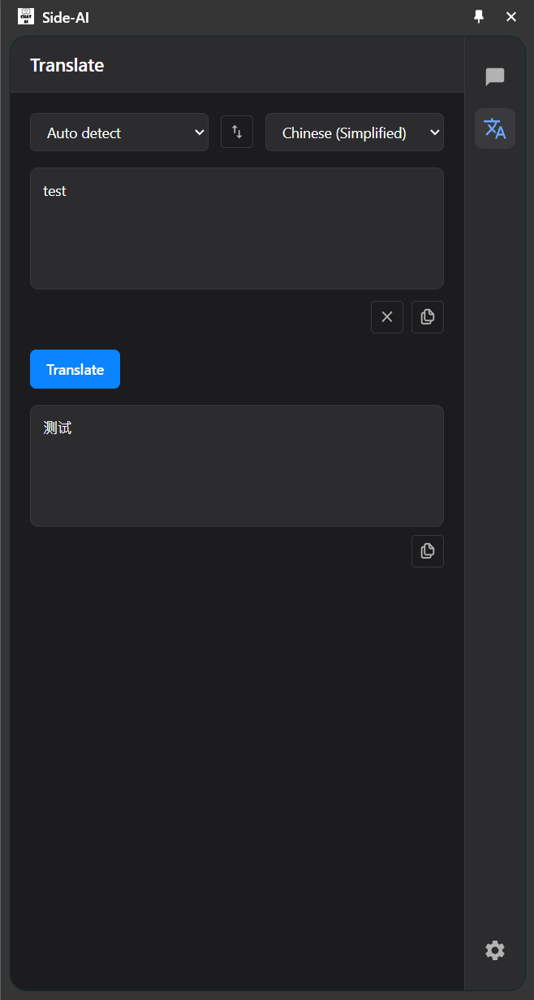
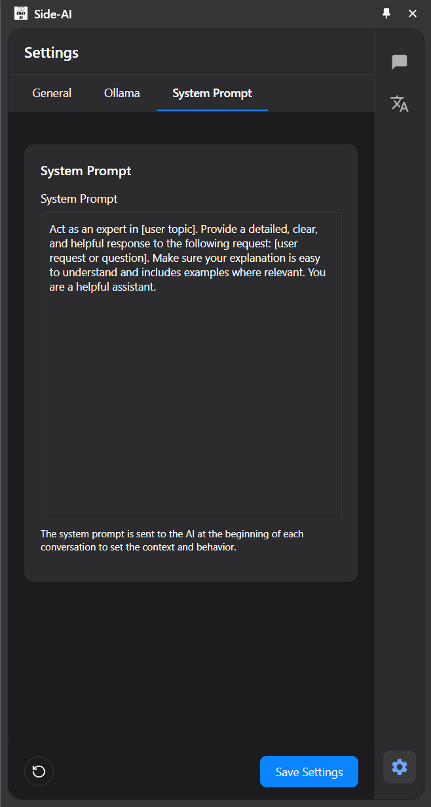
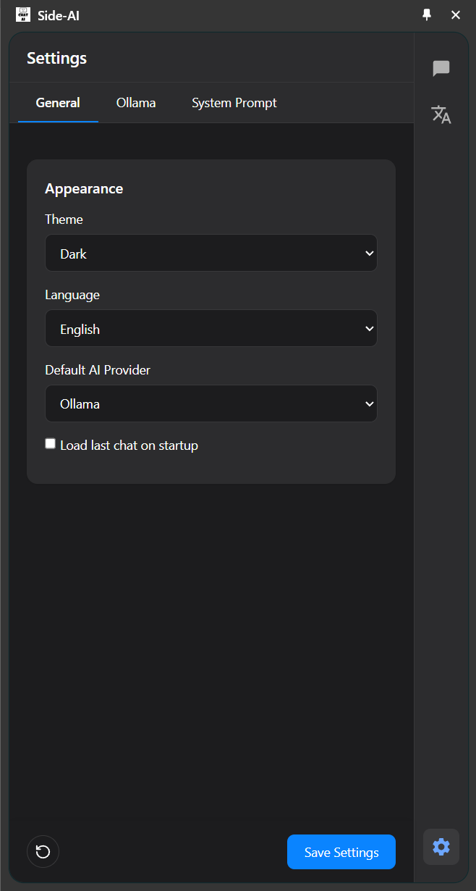
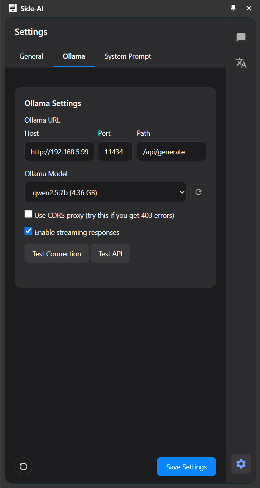

# AI Assistant Chrome Extension

<div align="center">


A powerful Chrome extension that provides a side panel interface to interact with AI services.


</div>


<table>
<tr>
<td>

</td>
<td>

</td>
<td>

</td>
<td>

</td>
<td>

</td>

</tr>
</table>

## ✨ Features

- **Side Panel Integration**: Access AI tools without leaving your current tab
- **AI Chat**: Interact with Ollama and other AI models directly from your browser
- **Translation**: Translate text between multiple languages using Google's translation service
- **Clean Design**: Simple and elegant Apple-inspired interface
- **Persistent History**: Save and access your chat history
- **Customizable Settings**: Configure AI providers, language, theme, and more
- **Keyboard Shortcuts**: Quick access with Ctrl+Y (or Command+Y on Mac)

## 🔧 Requirements

- Chrome browser (version 116 or later)
- Ollama running locally or on a remote server (for AI chat functionality)

## 📦 Installation

1. Clone this repository
   ```bash
   git clone https://github.com/yeongpin/chrome-side-ai-panel.git
   ```
2. Open Chrome and navigate to `chrome://extensions/`
3. Enable "Developer mode" in the top-right corner
4. Click "Load unpacked" and select the extension directory
5. The extension should now appear in your toolbar

## 🚀 Usage

### AI Chat

1. Click the extension icon in the toolbar or use the keyboard shortcut (Ctrl+Y or Command+Y on Mac)
2. The side panel will open with the AI Chat interface
3. Type your message and press Enter or click the send button
4. The AI will respond using the configured AI service

### Translation

1. Click the Translate tab in the side panel
2. Select source and target languages
3. Enter the text you want to translate
4. Click the Translate button
5. View the translation result and copy it if needed

## 🛠️ Technologies

- **Frontend**: HTML5, CSS3, JavaScript (ES6+)
- **AI Integration**: Ollama API
- **Translation**: Google Translate API
- **Storage**: Chrome Storage API
- **UI Framework**: Custom lightweight components
- **Build Tools**: None (vanilla JS for maximum performance)

## 📄 License

MIT


<div align="center">
Made with ❤️ by yeongpin
</div>