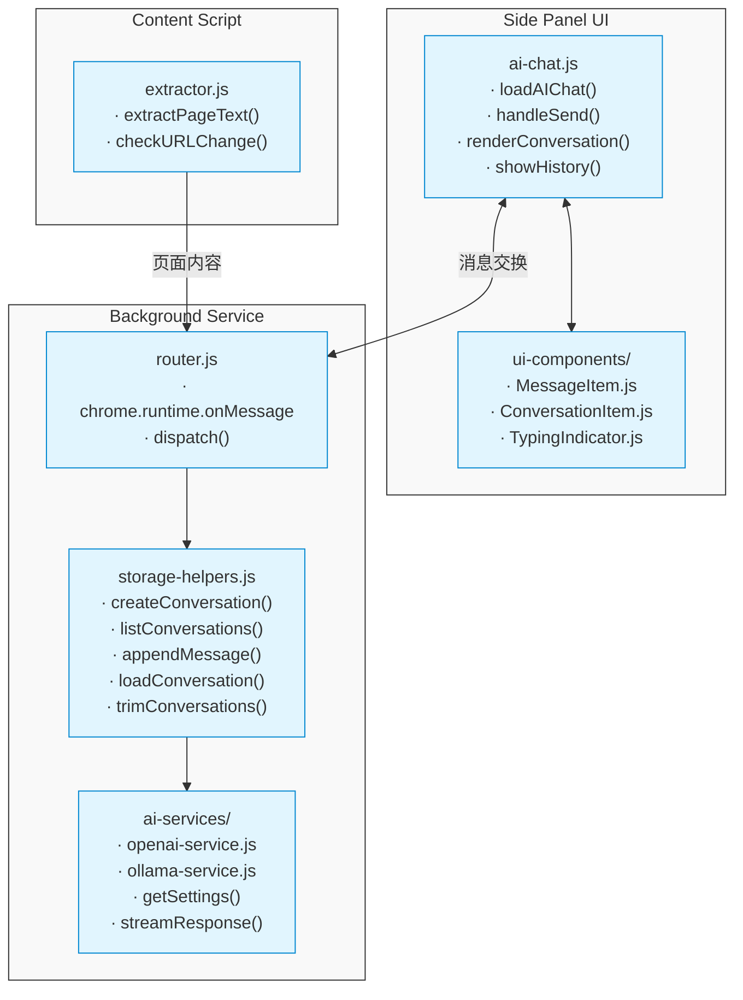

# Chrome-Side-Reader-Assistant 大模型对话能力
## 详细设计文档（按MVT划分）

## 目录
1. [基础架构与模块关系](#基础架构与模块关系)
2. [通用数据结构定义](#通用数据结构定义)
3. [MVT-0：单条对话原型](#MVT-0单条对话原型)
4. [MVT-1：Conversation层与UI按钮](#MVT-1Conversation层与UI按钮)
5. [MVT-2：Conversation持久化与Tab隔离](#MVT-2Conversation持久化与Tab隔离)
6. [MVT-3：Token控制与摘要注入](#MVT-3Token控制与摘要注入)
7. [MVT-4：流式展示与TypingIndicator](#MVT-4流式展示与TypingIndicator)
8. [MVT-5：清理机制与稳定性测试](#MVT-5清理机制与稳定性测试)
9. [MVT-6：系统提示词卡片与国际化](#MVT-6系统提示词卡片与国际化)

## 基础架构与模块关系
```
┌─ Side Panel UI ──────────────────────┐          ┌─ Background Service ──────────────┐
│                                      │          │                                   │
│  ┌─ ai-chat.js ──────────────────┐   │  消息    │  ┌─ router.js ─────────────────┐  │
│  │                               │◄──┼──交换────┼──┤                             │  │
│  │ ∙ loadAIChat()               │   │          │  │ ∙ chrome.runtime.onMessage  │  │
│  │ ∙ handleSend()               │   │          │  │ ∙ dispatch()                │  │
│  │ ∙ renderConversation()       │   │          │  └─────────────────────────────┘  │
│  │ ∙ showHistory()              │   │          │                ▲                   │
│  └───────────────────────────────┘   │          │                │                   │
│                ▲                     │          │                ▼                   │
│                │                     │          │  ┌─ storage-helpers.js ────────┐  │
│                ▼                     │          │  │                             │  │
│  ┌─ ui-components/ ───────────────┐  │          │  │ ∙ createConversation()     │  │
│  │                                │  │          │  │ ∙ listConversations()      │  │
│  │ ∙ MessageItem.js              │  │          │  │ ∙ appendMessage()          │  │
│  │ ∙ ConversationItem.js         │  │          │  │ ∙ loadConversation()       │  │
│  │ ∙ TypingIndicator.js          │  │          │  │ ∙ trimConversations()      │  │
│  └────────────────────────────────┘  │          │  └─────────────────────────────┘  │
│                                      │          │                ▲                   │
└──────────────────────────────────────┘          │                │                   │
                                                  │                ▼                   │
┌─ Content Script ──────────────────────┐         │  ┌─ ai-services/ ──────────────┐  │
│                                       │         │  │                             │  │
│  ┌─ extractor.js ───────────────────┐ │         │  │ ∙ openai-service.js        │  │
│  │                                  │ │ 页面    │  │ ∙ ollama-service.js        │  │
│  │ ∙ extractPageText()             │◄┼─内容────┼──┤ ∙ getSettings()            │  │
│  │ ∙ checkURLChange()              │ │         │  │ ∙ streamResponse()         │  │
│  └──────────────────────────────────┘ │         │  └─────────────────────────────┘  │
│                                       │         │                                   │
└───────────────────────────────────────┘         └───────────────────────────────────┘
```





## 通用数据结构定义

### 常量定义
```javascript
// src/js/constants.js
export const MAX_CONVERSATIONS_PER_TAB = 10;  // 每个标签页最多保存的对话数
export const MAX_MESSAGES_PER_CONVERSATION = 50;  // 每个对话最多保存的消息数
export const MAX_HISTORY_IN_CONTEXT = 6;  // 发送给模型的最近消息数
export const CLEANUP_INTERVAL_DAYS = 7;  // 自动清理N天未访问的数据
```

### 核心数据类型

```javascript
/**
 * 消息对象
 * @typedef {Object} Message
 * @property {string} id - 消息唯一ID
 * @property {string} role - 角色：'user'|'assistant'|'system'
 * @property {string} content - 消息内容
 * @property {string} [type] - 消息类型：'summary'|'normal'
 * @property {number} ts - 时间戳
 * @property {boolean} [pinned] - 是否固定消息（不被裁剪）
 */

/**
 * 对话元数据
 * @typedef {Object} ConversationMeta
 * @property {string} id - 对话ID
 * @property {string} title - 对话标题
 * @property {number} createdAt - 创建时间戳
 * @property {number} lastActiveAt - 最后活跃时间戳
 */

/**
 * 页面内容缓存
 * @typedef {Object} PageCache
 * @property {string} url - 页面URL
 * @property {string} content - 页面正文
 * @property {string} summary - 页面摘要
 * @property {number} timestamp - 缓存时间戳
 */
```

## MVT-0：单条对话原型

### 目标
实现最基础的对话功能，用户可以发送单条消息并接收完整回复，不保存历史，不支持流式展示。

### 开发项目
1. **ai-chat.js**：侧栏面板 UI 和交互逻辑
2. **openai-service.js**：OpenAI API 调用
3. **基础 UI 组件**：消息气泡、输入框、发送按钮

### 详细设计

#### 1. 侧栏 UI (ai-chat.js)
```javascript:src\js\modules\ai-chat.js
export function loadAIChat(container) {
  // 创建基础UI结构
  container.innerHTML = `
    <div class="chat-container">
      <div id="page-info" class="page-info-container">
        <div class="page-info">
          <div id="page-title" class="page-title"></div>
          <div id="page-url" class="page-url"></div>
        </div>
        <button id="summarize-btn" class="action-button">开始摘要</button>
      </div>
      <div id="chat-messages" class="chat-messages"></div>
      <div class="chat-input-wrapper">
        <div class="chat-actions">
          <button id="new-chat-button" class="action-button">
            
          </button>
          <button id="history-button" class="action-button">
            
          </button>
        </div>
        <textarea id="chat-input" placeholder="输入您的问题..."></textarea>
        <button id="send-button" class="primary-button">
          
        </button>
      </div>
    </div>
  `;

  // 获取DOM元素
  const chatInput = document.getElementById('chat-input');
  const sendButton = document.getElementById('send-button');
  const chatMessages = document.getElementById('chat-messages');
  
  // 绑定发送事件
  sendButton.addEventListener('click', handleSend);
  chatInput.addEventListener('keydown', (e) => {
    if (e.key === 'Enter' && !e.shiftKey) {
      e.preventDefault();
      handleSend();
    }
  });

  // 显示当前页面信息
  updatePageInfo();
}

// 处理消息发送
async function handleSend() {
  const chatInput = document.getElementById('chat-input');
  const chatMessages = document.getElementById('chat-messages');
  const text = chatInput.value.trim();
  
  if (!text) return;
  
  // 显示用户消息
  addMessageToUI('user', text);
  chatInput.value = '';
  
  try {
    // 调用OpenAI API
    const systemPrompt = "你是一个有帮助的AI助手。"; // 固定提示词
    const response = await sendMessageToOpenAI([
      { role: 'system', content: systemPrompt },
      { role: 'user', content: text }
    ]);
    
    // 显示AI回复
    addMessageToUI('assistant', response.choices[0].message.content);
  } catch (error) {
    console.error('Error sending message:', error);
    // 显示错误消息
    addMessageToUI('assistant', '抱歉，发生了错误: ' + error.message, 'error');
  }
}

// 添加消息到UI
function addMessageToUI(role, content, type = null) {
  const chatMessages = document.getElementById('chat-messages');
  const messageEl = document.createElement('div');
  messageEl.className = `message ${role}-message`;
  
  if (type) {
    messageEl.classList.add(`${type}-message`);
  }
  
  messageEl.innerHTML = `
    <div class="message-content">${escapeHtml(content)}</div>
  `;
  
  chatMessages.appendChild(messageEl);
  chatMessages.scrollTop = chatMessages.scrollHeight;
}

// 更新页面信息
async function updatePageInfo() {
  const [tab] = await chrome.tabs.query({ active: true, currentWindow: true });
  if (tab) {
    document.getElementById('page-title').textContent = tab.title || 'Unknown Page';
    document.getElementById('page-url').textContent = tab.url || '';
  }
}

// 辅助：HTML转义
function escapeHtml(text) {
  const div = document.createElement('div');
  div.textContent = text;
  return div.innerHTML;
}
```

#### 2. OpenAI服务 (openai-service.js)
```javascript:src\js\services\openai-service.js
export async function getSettings() {
  return new Promise((resolve) => {
    chrome.storage.sync.get({
      openaiApiKey: '',
      openaiModel: 'gpt-4o-mini',
      useProxy: false,
      proxyUrl: '',
      systemPrompt: '你是一个有帮助的AI助手。'
    }, (settings) => {
      resolve(settings);
    });
  });
}

export async function sendMessageToOpenAI(messages) {
  const settings = await getSettings();
  
  if (!settings.openaiApiKey) {
    throw new Error('未设置API密钥，请在设置中配置');
  }
  
  const apiUrl = settings.useProxy && settings.proxyUrl
    ? settings.proxyUrl
    : 'https://api.openai.com/v1/chat/completions';
  
  const response = await fetch(apiUrl, {
    method: 'POST',
    headers: {
      'Content-Type': 'application/json',
      'Authorization': `Bearer ${settings.openaiApiKey}`
    },
    body: JSON.stringify({
      model: settings.openaiModel,
      messages: messages,
      temperature: 0.7
    })
  });
  
  if (!response.ok) {
    const error = await response.json();
    throw new Error(error.error?.message || '请求失败');
  }
  
  return await response.json();
}
```

### 验收标准
1. 用户能在侧栏输入文本并发送
2. 系统调用OpenAI API并显示回复
3. 显示正确的页面标题和URL
4. 侧栏刷新后，消息历史被清空（符合此阶段无持久化要求）

## MVT-1：Conversation层与UI按钮

### 目标
实现"新聊天"和"聊天历史"按钮功能，引入Conversation概念，创建多会话UI框架。

### 开发项目
1. **ConversationItem 组件**：单个聊天记录项
2. **历史弹窗**：显示聊天历史列表
3. **新聊天功能**：清空当前聊天，准备开始新会话

### 详细设计
#### 1. ai-chat.js 修改
```javascript:src\js\modules\ai-chat.js
// 扩展现有loadAIChat函数，添加聊天历史弹窗
export function loadAIChat(container) {
  // ...原先的UI代码...
  
  // 添加聊天历史弹窗
  const historyPopup = document.createElement('div');
  historyPopup.id = 'history-popup';
  historyPopup.className = 'history-popup';
  historyPopup.innerHTML = `
    <div class="history-header">
      <h3 data-i18n="chat.historyTitle">聊天历史</h3>
      <button id="close-history" class="icon-button">
        
      </button>
    </div>
    <div id="history-list" class="history-list"></div>
  `;
  document.body.appendChild(historyPopup);
  
  // 添加事件监听
  const newChatButton = document.getElementById('new-chat-button');
  const historyButton = document.getElementById('history-button');
  const closeHistory = document.getElementById('close-history');
  
  newChatButton.addEventListener('click', handleNewChat);
  historyButton.addEventListener('click', showHistory);
  closeHistory.addEventListener('click', hideHistory);
  
  // 记录当前会话ID
  window.currentConversationId = `conv_${Date.now()}`;
}

// 处理"新聊天"按钮
function handleNewChat() {
  // 清空聊天区域
  const chatMessages = document.getElementById('chat-messages');
  chatMessages.innerHTML = '';
  
  // 创建新会话ID
  window.currentConversationId = `conv_${Date.now()}`;
  
  // 添加欢迎消息
  addMessageToUI('assistant', '有什么我可以帮你的？');
}

// 显示聊天历史
function showHistory() {
  const historyPopup = document.getElementById('history-popup');
  historyPopup.classList.add('active');
  
  // 模拟聊天历史数据 (后续MVT会替换为实际存储数据)
  const mockConversations = [
    { id: 'conv_1', title: '关于JavaScript的问题', lastActiveAt: Date.now() - 3600000 },
    { id: 'conv_2', title: '如何使用React Hooks', lastActiveAt: Date.now() - 7200000 }
  ];
  
  renderConversationList(mockConversations);
}

// 隐藏聊天历史
function hideHistory() {
  const historyPopup = document.getElementById('history-popup');
  historyPopup.classList.remove('active');
}

// 渲染会话列表
function renderConversationList(conversations) {
  const historyList = document.getElementById('history-list');
  historyList.innerHTML = '';
  
  if (conversations.length === 0) {
    historyList.innerHTML = '<div class="empty-history">没有聊天记录</div>';
    return;
  }
  
  conversations.forEach(conv => {
    const convItem = createConversationItem(conv);
    historyList.appendChild(convItem);
  });
}

// 创建单个会话项
function createConversationItem(conversation) {
  const item = document.createElement('div');
  item.className = 'conversation-item';
  item.dataset.id = conversation.id;
  
  const date = new Date(conversation.lastActiveAt);
  const formattedDate = `${date.getMonth()+1}/${date.getDate()} ${date.getHours()}:${date.getMinutes().toString().padStart(2, '0')}`;
  
  item.innerHTML = `
    <div class="conversation-title">${escapeHtml(conversation.title)}</div>
    <div class="conversation-date">${formattedDate}</div>
  `;
  
  // 切换到此对话
  item.addEventListener('click', () => {
    window.currentConversationId = conversation.id;
    // 这里仅UI演示，MVT-2会添加实际加载功能
    const chatMessages = document.getElementById('chat-messages');
    chatMessages.innerHTML = '';
    addMessageToUI('assistant', `已切换到对话: ${conversation.title}`);
    hideHistory();
  });
  
  return item;
}

// 处理消息发送 (修改版)
async function handleSend() {
  // ...原先的代码...
  
  // 添加会话ID关联
  const messageData = {
    id: `msg_${Date.now()}`,
    role: 'user',
    content: text,
    conversationId: window.currentConversationId,
    timestamp: Date.now()
  };
  
  // ...调用API和展示回复的代码...
}
```

#### 2. 聊天历史弹窗样式
```css:src\css\chat.css
/* 聊天历史弹窗 */
.history-popup {
  position: fixed;
  top: 0;
  left: 0;
  width: 100%;
  height: 100%;
  background-color: var(--bg-color);
  z-index: 100;
  display: none;
  flex-direction: column;
}

.history-popup.active {
  display: flex;
}

.history-header {
  display: flex;
  justify-content: space-between;
  align-items: center;
  padding: 10px 15px;
  border-bottom: 1px solid var(--border-color);
}

.history-header h3 {
  margin: 0;
  font-size: 16px;
}

.history-list {
  flex: 1;
  overflow-y: auto;
  padding: 10px;
}

.conversation-item {
  padding: 12px 15px;
  border-radius: 8px;
  margin-bottom: 8px;
  background-color: var(--card-bg);
  cursor: pointer;
  transition: background-color 0.2s;
}

.conversation-item:hover {
  background-color: var(--hover-bg);
}

.conversation-title {
  font-weight: 500;
  margin-bottom: 5px;
  color: var(--text-color);
}

.conversation-date {
  font-size: 12px;
  color: var(--secondary-text-color);
}

.empty-history {
  text-align: center;
  padding: 20px;
  color: var(--secondary-text-color);
}
```

### 验收标准
1. "新聊天"按钮点击后清空当前消息区域
2. "聊天历史"按钮点击后显示历史弹窗（虽然是模拟数据）
3. 从历史弹窗中可以点击切换对话（虽然只有UI效果）
4. 消息内部关联至当前conversationId（虽然尚未持久化）

## MVT-2：Conversation持久化与Tab隔离

### 目标
实现对话的持久化存储和标签页隔离，使得对话状态在侧栏刷新或标签页切换后能够恢复。

### 开发项目
1. **storage-helpers.js**：存储工具函数
2. **background.js添加路由**：处理对话相关的消息
3. **ai-chat.js扩展**：支持加载和保存对话

### 详细设计
#### 1. 存储工具函数
```javascript:src\js\services\storage-helpers.js
import { MAX_CONVERSATIONS_PER_TAB, MAX_MESSAGES_PER_CONVERSATION } from '../constants.js';

/**
 * 创建新的对话
 * @param {string} tabId - 标签页ID
 * @param {string} [title] - 对话标题（可选）
 * @returns {Promise<string>} - 新创建的对话ID
 */
export async function createConversation(tabId, title = '新对话') {
  // 获取当前标签页的对话元数据列表
  const metaList = await listConversations(tabId);
  
  // 创建新对话ID
  const conversationId = `${tabId}_${Date.now()}`;
  
  // 创建新对话元数据
  const newConversation = {
    id: conversationId,
    title: title,
    createdAt: Date.now(),
    lastActiveAt: Date.now()
  };
  
  // 添加到列表前端（最新的在前面）
  metaList.unshift(newConversation);
  
  // 如果超出上限，删除最老的对话
  if (metaList.length > MAX_CONVERSATIONS_PER_TAB) {
    const removed = metaList.pop();
    // 同时删除对应的消息
    await chrome.storage.local.remove([`conversationMessages_${removed.id}`]);
  }
  
  // 保存更新后的元数据列表
  await chrome.storage.local.set({ [`conversationMeta_${tabId}`]: metaList });
  
  // 初始化空消息列表
  await chrome.storage.local.set({ [`conversationMessages_${conversationId}`]: [] });
  
  // 更新当前活动对话ID
  await chrome.storage.local.set({ [`currentConvId_${tabId}`]: conversationId });
  
  return conversationId;
}

/**
 * 获取标签页的所有对话元数据
 * @param {string} tabId - 标签页ID
 * @returns {Promise<Array<ConversationMeta>>} - 对话元数据数组
 */
export async function listConversations(tabId) {
  return new Promise(resolve => {
    chrome.storage.local.get([`conversationMeta_${tabId}`], result => {
      resolve(result[`conversationMeta_${tabId}`] || []);
    });
  });
}

/**
 * 加载指定对话的所有消息
 * @param {string} conversationId - 对话ID
 * @returns {Promise<Array<Message>>} - 消息数组
 */
export async function loadConversation(conversationId) {
  return new Promise(resolve => {
    chrome.storage.local.get([`conversationMessages_${conversationId}`], result => {
      resolve(result[`conversationMessages_${conversationId}`] || []);
    });
  });
}

/**
 * 切换到指定对话
 * @param {string} tabId - 标签页ID
 * @param {string} conversationId - 对话ID
 * @returns {Promise<void>}
 */
export async function switchConversation(tabId, conversationId) {
  // 更新当前活动对话ID
  await chrome.storage.local.set({ [`currentConvId_${tabId}`]: conversationId });
  
  // 更新对话的最后活跃时间
  const metaList = await listConversations(tabId);
  const index = metaList.findIndex(conv => conv.id === conversationId);
  
  if (index !== -1) {
    metaList[index].lastActiveAt = Date.now();
    await chrome.storage.local.set({ [`conversationMeta_${tabId}`]: metaList });
  }
}

/**
 * 获取标签页当前活动的对话ID
 * @param {string} tabId - 标签页ID
 * @returns {Promise<string|null>} - 当前活动对话ID
 */
export async function getCurrentConversationId(tabId) {
  return new Promise(resolve => {
    chrome.storage.local.get([`currentConvId_${tabId}`], result => {
      resolve(result[`currentConvId_${tabId}`] || null);
    });
  });
}

/**
 * 向对话中添加消息
 * @param {string} conversationId - 对话ID
 * @param {Message} message - 消息对象
 * @returns {Promise<void>}
 */
export async function appendMessage(conversationId, message) {
  // 加载当前消息列表
  const messages = await loadConversation(conversationId);
  
  // 添加新消息
  messages.push(message);
  
  // 裁剪消息数量
  const trimmedMessages = trimMessages(messages);
  
  // 保存更新后的消息列表
  await chrome.storage.local.set({ [`conversationMessages_${conversationId}`]: trimmedMessages });
  
  // 提取标签页ID
  const tabId = conversationId.split('_')[0];
  
  // 更新对话标题（如果是第一条用户消息）
  if (message.role === 'user' && messages.filter(m => m.role === 'user').length === 1) {
    await updateConversationTitle(tabId, conversationId, message.content);
  }
  
  // 更新对话的最后活跃时间
  await updateConversationActivity(tabId, conversationId);
}

/**
 * 更新对话标题
 * @param {string} tabId - 标签页ID
 * @param {string} conversationId - 对话ID
 * @param {string} content - 用作标题的内容
 * @returns {Promise<void>}
 */
async function updateConversationTitle(tabId, conversationId, content) {
  const metaList = await listConversations(tabId);
  const index = metaList.findIndex(conv => conv.id === conversationId);
  
  if (index !== -1) {
    // 使用用户的第一条消息作为标题（最多30个字符）
    metaList[index].title = content.length > 30 
      ? content.substring(0, 27) + '...' 
      : content;
    
    await chrome.storage.local.set({ [`conversationMeta_${tabId}`]: metaList });
  }
}

/**
 * 更新对话的最后活跃时间
 * @param {string} tabId - 标签页ID
 * @param {string} conversationId - 对话ID
 * @returns {Promise<void>}
 */
async function updateConversationActivity(tabId, conversationId) {
  const metaList = await listConversations(tabId);
  const index = metaList.findIndex(conv => conv.id === conversationId);
  
  if (index !== -1) {
    metaList[index].lastActiveAt = Date.now();
    await chrome.storage.local.set({ [`conversationMeta_${tabId}`]: metaList });
  }
}

/**
 * 裁剪消息列表，保证不超过上限
 * @param {Array<Message>} messages - 消息数组
 * @returns {Array<Message>} - 裁剪后的消息数组
 */
function trimMessages(messages) {
  // 如果消息数量未超出上限，直接返回
  if (messages.length <= MAX_MESSAGES_PER_CONVERSATION) {
    return messages;
  }
  
  // 提取固定消息（系统消息和摘要）
  const pinnedMessages = messages.filter(msg => 
    msg.pinned || msg.role === 'system' || msg.type === 'summary'
  );
  
  // 提取普通消息（除固定消息外的所有消息）
  const regularMessages = messages.filter(msg => 
    !msg.pinned && msg.role !== 'system' && msg.type !== 'summary'
  );
  
  // 计算可保留的普通消息数量
  const keepCount = MAX_MESSAGES_PER_CONVERSATION - pinnedMessages.length;
  
  // 保留最新的普通消息
  const keptRegularMessages = regularMessages.slice(-keepCount);
  
  // 合并固定消息和保留的普通消息
  return [...pinnedMessages, ...keptRegularMessages];
}
```

#### 2. Background 消息路由扩展

```javascript:chrome\background.js
// ... 原有代码 ...

// 处理runtime消息
chrome.runtime.onMessage.addListener((request, sender, sendResponse) => {
  // ... 原有代码 ...
  
  // 创建新对话
  if (request.action === 'createConversation') {
    const tabId = request.tabId;
    createConversation(tabId, request.title)
      .then(conversationId => {
        sendResponse({ success: true, conversationId });
      })
      .catch(error => {
        console.error('创建对话失败:', error);
        sendResponse({ success: false, error: error.message });
      });
    return true;  // 异步响应
  }
  
  // 获取标签页所有对话
  else if (request.action === 'listConversations') {
    const tabId = request.tabId;
    listConversations(tabId)
      .then(conversations => {
        sendResponse({ success: true, conversations });
      })
      .catch(error => {
        console.error('获取对话列表失败:', error);
        sendResponse({ success: false, error: error.message });
      });
    return true;  // 异步响应
  }
  
  // 获取对话消息
  else if (request.action === 'loadConversation') {
    const conversationId = request.conversationId;
    loadConversation(conversationId)
      .then(messages => {
        sendResponse({ success: true, messages });
      })
      .catch(error => {
        console.error('加载对话失败:', error);
        sendResponse({ success: false, error: error.message });
      });
    return true;  // 异步响应
  }
  
  // 切换对话
  else if (request.action === 'switchConversation') {
    const tabId = request.tabId;
    const conversationId = request.conversationId;
    switchConversation(tabId, conversationId)
      .then(() => {
        sendResponse({ success: true });
      })
      .catch(error => {
        console.error('切换对话失败:', error);
        sendResponse({ success: false, error: error.message });
      });
    return true;  // 异步响应
  }
  
  // 获取当前对话ID
  else if (request.action === 'getCurrentConversationId') {
    const tabId = request.tabId;
    getCurrentConversationId(tabId)
      .then(conversationId => {
        sendResponse({ success: true, conversationId });
      })
      .catch(error => {
        console.error('获取当前对话ID失败:', error);
        sendResponse({ success: false, error: error.message });
      });
    return true;  // 异步响应
  }
  
  // 添加消息
  else if (request.action === 'appendMessage') {
    const conversationId = request.conversationId;
    const message = request.message;
    appendMessage(conversationId, message)
      .then(() => {
        sendResponse({ success: true });
      })
      .catch(error => {
        console.error('添加消息失败:', error);
        sendResponse({ success: false, error: error.message });
      });
    return true;  // 异步响应
  }
  
  // ... 其他消息处理 ...
});

// 监听标签页切换
chrome.tabs.onActivated.addListener(async (activeInfo) => {
  // 当切换标签页时，通知侧栏
  chrome.runtime.sendMessage({
    action: 'tabChanged',
    tabId: activeInfo.tabId
  }).catch(err => console.error('发送标签切换消息失败:', err));
});

// ... 导入存储工具函数 ...
import { 
  createConversation, 
  listConversations,
  loadConversation,
  switchConversation,
  getCurrentConversationId,
  appendMessage
} from '../src/js/services/storage-helpers.js';
```

#### 3. AI聊天模块扩展

```javascript:src\js\modules\ai-chat.js
import { 
  MAX_HISTORY_IN_CONTEXT
} from '../constants.js';

// 侧栏初始化 (增强版)
export async function loadAIChat(container) {
  // ... 原有UI初始化代码 ...
  
  // 获取当前标签页
  const [tab] = await chrome.tabs.query({ active: true, currentWindow: true });
  if (!tab) return;
  
  const tabId = tab.id;
  
  // 加载当前标签页的活动对话
  await loadCurrentConversation(tabId);
  
  // 监听标签页变化
  chrome.runtime.onMessage.addListener((message) => {
    if (message.action === 'tabChanged' && message.tabId) {
      loadCurrentConversation(message.tabId);
    }
  });
}

// 加载当前标签页的活动对话
async function loadCurrentConversation(tabId) {
  try {
    // 获取当前对话ID
    const { success, conversationId } = await chrome.runtime.sendMessage({
      action: 'getCurrentConversationId',
      tabId: tabId
    });
    
    if (success && conversationId) {
      // 加载对话消息
      await loadAndRenderConversation(conversationId);
    } else {
      // 如果没有当前对话，创建一个新的
      const { success, conversationId } = await chrome.runtime.sendMessage({
        action: 'createConversation',
        tabId: tabId
      });
      
      if (success) {
        window.currentConversationId = conversationId;
        // 显示欢迎消息
        const chatMessages = document.getElementById('chat-messages');
        chatMessages.innerHTML = '';
        addMessageToUI('assistant', '有什么我可以帮你的？');
      }
    }
  } catch (error) {
    console.error('加载当前对话失败:', error);
  }
}

// 加载并渲染对话
async function loadAndRenderConversation(conversationId) {
  try {
    // 设置当前对话ID
    window.currentConversationId = conversationId;
    
    // 获取对话消息
    const { success, messages } = await chrome.runtime.sendMessage({
      action: 'loadConversation',
      conversationId: conversationId
    });
    
    if (success) {
      // 清空消息区域
      const chatMessages = document.getElementById('chat-messages');
      chatMessages.innerHTML = '';
      
      // 渲染所有消息
      messages.forEach(msg => {
        if (msg.role !== 'system') {  // 不显示系统消息
          addMessageToUI(msg.role, msg.content, msg.type);
        }
      });
      
      // 如果没有消息，显示欢迎信息
      if (messages.filter(m => m.role !== 'system').length === 0) {
        addMessageToUI('assistant', '有什么我可以帮你的？');
      }
    }
  } catch (error) {
    console.error('加载对话失败:', error);
  }
}

// 处理新聊天按钮 (修改版)
async function handleNewChat() {
  try {
    // 获取当前标签页
    const [tab] = await chrome.tabs.query({ active: true, currentWindow: true });
    if (!tab) return;
    
    // 创建新对话
    const { success, conversationId } = await chrome.runtime.sendMessage({
      action: 'createConversation',
      tabId: tab.id
    });
    
    if (success) {
      // 更新当前对话ID
      window.currentConversationId = conversationId;
      
      // 清空消息区域
      const chatMessages = document.getElementById('chat-messages');
      chatMessages.innerHTML = '';
      
      // 显示欢迎消息
      addMessageToUI('assistant', '有什么我可以帮你的？');
    }
  } catch (error) {
    console.error('创建新对话失败:', error);
  }
}

// 显示聊天历史 (修改版)
async function showHistory() {
  try {
    // 获取当前标签页
    const [tab] = await chrome.tabs.query({ active: true, currentWindow: true });
    if (!tab) return;
    
    // 获取对话列表
    const { success, conversations } = await chrome.runtime.sendMessage({
      action: 'listConversations',
      tabId: tab.id
    });
    
    if (success) {
      // 显示历史弹窗
      const historyPopup = document.getElementById('history-popup');
      historyPopup.classList.add('active');
      
      // 渲染对话列表
      renderConversationList(conversations);
    }
  } catch (error) {
    console.error('获取对话列表失败:', error);
  }
}

// 渲染对话列表 (不变)

// 创建单个对话项 (修改版)
function createConversationItem(conversation) {
  // ... 前部分不变 ...
  
  // 切换到此对话
  item.addEventListener('click', async () => {
    try {
      // 获取当前标签页
      const [tab] = await chrome.tabs.query({ active: true, currentWindow: true });
      if (!tab) return;
      
      // 切换对话
      const { success } = await chrome.runtime.sendMessage({
        action: 'switchConversation',
        tabId: tab.id,
        conversationId: conversation.id
      });
      
      if (success) {
        // 加载对话内容
        await loadAndRenderConversation(conversation.id);
        // 隐藏历史弹窗
        hideHistory();
      }
    } catch (error) {
      console.error('切换对话失败:', error);
    }
  });
  
  return item;
}

// 处理消息发送 (修改版)
async function handleSend() {
  const chatInput = document.getElementById('chat-input');
  const text = chatInput.value.trim();
  
  if (!text || !window.currentConversationId) return;
  
  // 清空输入框
  chatInput.value = '';
  
  // 创建消息对象
  const userMessage = {
    id: `msg_${Date.now()}`,
    role: 'user',
    content: text,
    ts: Date.now()
  };
  
  // 显示用户消息
  addMessageToUI('user', text);
  
  try {
    // 添加用户消息到存储
    await chrome.runtime.sendMessage({
      action: 'appendMessage',
      conversationId: window.currentConversationId,
      message: userMessage
    });
    
    // 加载对话的所有消息
    const { success, messages } = await chrome.runtime.sendMessage({
      action: 'loadConversation',
      conversationId: window.currentConversationId
    });
    
    if (success) {
      // 构建发送给模型的消息上下文
      const systemPrompt = messages.find(m => m.role === 'system')?.content || 
                          "你是一个有帮助的AI助手。";
      
      // 提取最近的消息作为上下文
      const recentMessages = messages
        .filter(m => m.role !== 'system')
        .slice(-MAX_HISTORY_IN_CONTEXT);
      
      // 组装发送给模型的消息
      const contextMessages = [
        { role: 'system', content: systemPrompt },
        ...recentMessages,
        userMessage
      ];
      
      // 调用API
      const response = await sendMessageToOpenAI(contextMessages);
      
      // 提取AI回复
      const assistantContent = response.choices[0].message.content;
      
      // 显示AI回复
      addMessageToUI('assistant', assistantContent);
      
      // 创建AI回复消息对象
      const assistantMessage = {
        id: `msg_${Date.now()}`,
        role: 'assistant',
        content: assistantContent,
        ts: Date.now()
      };
      
      // 添加AI回复到存储
      await chrome.runtime.sendMessage({
        action: 'appendMessage',
        conversationId: window.currentConversationId,
        message: assistantMessage
      });
    }
  } catch (error) {
    console.error('发送消息失败:', error);
    // 显示错误消息
    addMessageToUI('assistant', '抱歉，发生了错误: ' + error.message, 'error');
    
    // 记录错误消息到存储
    const errorMessage = {
      id: `msg_${Date.now()}`,
      role: 'assistant',
      content: '抱歉，发生了错误: ' + error.message,
      type: 'error',
      ts: Date.now()
    };
    
    await chrome.runtime.sendMessage({
      action: 'appendMessage',
      conversationId: window.currentConversationId,
      message: errorMessage
    });
  }
}
```

### 验收标准
1. 对话在侧栏刷新后能够恢复
2. 每个标签页有独立的对话列表
3. "新聊天"按钮能创建新的对话并保存
4. "聊天历史"按钮能显示当前标签页的所有对话
5. 从历史列表中选择对话能正确加载对应的消息
6. 标签页切换时，自动加载对应标签页的活动对话

## MVT-3：Token控制与摘要注入

### 目标
实现Token数量控制，并将页面摘要作为上下文注入到对话中，提高模型回答质量。

### 开发项目
1. **页面摘要集成**：将页面摘要作为特殊消息存储
2. **Token计数控制**：限制发送给模型的消息数量
3. **摘要自动更新**：当页面内容变化时更新摘要

### 详细设计
#### 1. 页面摘要处理

```javascript:src\js\services\storage-helpers.js
/**
 * 添加或更新对话的摘要消息
 * @param {string} conversationId - 对话ID
 * @param {string} summary - 摘要内容
 * @param {string} url - 页面URL
 * @returns {Promise<void>}
 */
export async function updateConversationSummary(conversationId, summary, url) {
  // 加载当前消息列表
  const messages = await loadConversation(conversationId);
  
  // 查找是否已有摘要消息
  const summaryIndex = messages.findIndex(msg => msg.type === 'summary');
  
  // 构建摘要消息
  const summaryMessage = {
    id: summaryIndex >= 0 ? messages[summaryIndex].id : `summary_${Date.now()}`,
    role: 'assistant',
    content: summary,
    type: 'summary',
    pageUrl: url,
    ts: Date.now(),
    pinned: true  // 标记为固定消息，不会被裁剪
  };
  
  if (summaryIndex >= 0) {
    // 更新现有摘要
    messages[summaryIndex] = summaryMessage;
  } else {
    // 添加新摘要
    // 找出系统消息的位置
    const systemIndex = messages.findIndex(msg => msg.role === 'system');
    if (systemIndex >= 0) {
      // 插入到系统消息后面
      messages.splice(systemIndex + 1, 0, summaryMessage);
    } else {
      // 没有系统消息，插入到最前面
      messages.unshift(summaryMessage);
    }
  }
  
  // 保存更新后的消息列表
  await chrome.storage.local.set({ [`conversationMessages_${conversationId}`]: messages });
}

/**
 * 为对话添加系统提示词消息
 * @param {string} conversationId - 对话ID
 * @param {string} systemPrompt - 系统提示词内容
 * @returns {Promise<void>}
 */
export async function setConversationSystemPrompt(conversationId, systemPrompt) {
  // 加载当前消息列表
  const messages = await loadConversation(conversationId);
  
  // 查找是否已有系统消息
  const systemIndex = messages.findIndex(msg => msg.role === 'system');
  
  // 构建系统消息
  const systemMessage = {
    id: systemIndex >= 0 ? messages[systemIndex].id : `system_${Date.now()}`,
    role: 'system',
    content: systemPrompt,
    ts: Date.now(),
    pinned: true  // 标记为固定消息，不会被裁剪
  };
  
  if (systemIndex >= 0) {
    // 更新现有系统消息
    messages[systemIndex] = systemMessage;
  } else {
    // 添加新系统消息到最前面
    messages.unshift(systemMessage);
  }
  
  // 保存更新后的消息列表
  await chrome.storage.local.set({ [`conversationMessages_${conversationId}`]: messages });
}
```

#### 2. 摘要注入到对话

```javascript:chrome\background.js
// ... 原有代码 ...

// 处理runtime消息
chrome.runtime.onMessage.addListener((request, sender, sendResponse) => {
  // ... 原有代码 ...
  
  // 更新对话摘要
  else if (request.action === 'updateConversationSummary') {
    const conversationId = request.conversationId;
    const summary = request.summary;
    const url = request.url;
    
    updateConversationSummary(conversationId, summary, url)
      .then(() => {
        sendResponse({ success: true });
      })
      .catch(error => {
        console.error('更新对话摘要失败:', error);
        sendResponse({ success: false, error: error.message });
      });
    return true;  // 异步响应
  }
  
  // 设置对话系统提示词
  else if (request.action === 'setConversationSystemPrompt') {
    const conversationId = request.conversationId;
    const systemPrompt = request.systemPrompt;
    
    setConversationSystemPrompt(conversationId, systemPrompt)
      .then(() => {
        sendResponse({ success: true });
      })
      .catch(error => {
        console.error('设置对话系统提示词失败:', error);
        sendResponse({ success: false, error: error.message });
      });
    return true;  // 异步响应
  }
  
  // 获取页面上下文（现有摘要服务）
  else if (request.action === 'getPageContext') {
    const tabId = request.tabId;
    
    // 获取页面缓存
    const cache = pageCache[tabId];
    if (cache) {
      sendResponse({
        success: true,
        url: cache.url,
        content: cache.content,
        summary: cache.summary
      });
    } else {
      sendResponse({
        success: false,
        error: '页面内容未缓存'
      });
    }
    return true;
  }
  
  // ... 其他消息处理 ...
});

// ... 导入存储工具函数 ...
import {
  // ... 原有导入 ...
  updateConversationSummary,
  setConversationSystemPrompt
} from '../src/js/services/storage-helpers.js';
```

#### 3. AI聊天模块集成摘要

```javascript:src\js\modules\ai-chat.js
// ... 原有导入 ...
import { getSettings } from '../services/openai-service.js';

// 在loadAIChat中初始化摘要按钮
export async function loadAIChat(container) {
  // ... 原有UI初始化代码 ...
  
  // 绑定摘要按钮
  const summarizeBtn = document.getElementById('summarize-btn');
  if (summarizeBtn) {
    summarizeBtn.addEventListener('click', handleSummarize);
  }
  
  // ... 其他初始化代码 ...
}

// 处理摘要按钮点击
async function handleSummarize() {
  try {
    // 获取当前标签页
    const [tab] = await chrome.tabs.query({ active: true, currentWindow: true });
    if (!tab) return;
    
    // 显示摘要加载状态
    const summarizeBtn = document.getElementById('summarize-btn');
    summarizeBtn.disabled = true;
    summarizeBtn.textContent = '正在生成摘要...';
    
    // 显示加载消息
    const loadingId = `loading_${Date.now()}`;
    addMessageToUI('assistant', '正在生成页面摘要...', 'loading', loadingId);
    
    // 请求摘要
    const response = await chrome.runtime.sendMessage({
      action: 'summarizePage',
      tabId: tab.id
    });
    
    // 处理摘要响应
    if (response && response.success) {
      // 移除加载消息
      const loadingMsg = document.getElementById(loadingId);
      if (loadingMsg) loadingMsg.remove();
      
      // 显示摘要
      addMessageToUI('assistant', response.summary, 'summary');
      
      // 保存摘要到当前对话
      if (window.currentConversationId) {
        await chrome.runtime.sendMessage({
          action: 'updateConversationSummary',
          conversationId: window.currentConversationId,
          summary: response.summary,
          url: tab.url
        });
      }
    } else {
      // 显示错误
      const loadingMsg = document.getElementById(loadingId);
      if (loadingMsg) {
        loadingMsg.textContent = '摘要生成失败: ' + (response?.error || '未知错误');
        loadingMsg.classList.remove('loading-message');
        loadingMsg.classList.add('error-message');
      }
    }
  } catch (error) {
    console.error('生成摘要失败:', error);
    addMessageToUI('assistant', '摘要生成失败: ' + error.message, 'error');
  } finally {
    // 恢复按钮状态
    const summarizeBtn = document.getElementById('summarize-btn');
    summarizeBtn.disabled = false;
    summarizeBtn.textContent = '开始摘要';
  }
}

// 处理新建对话时添加系统提示词
async function handleNewChat() {
  try {
    // ... 原有创建新对话代码 ...
    
    // 成功创建新对话后
    if (success) {
      // ... 原有代码 ...
      
      // 获取并设置系统提示词
      const settings = await getSettings();
      await chrome.runtime.sendMessage({
        action: 'setConversationSystemPrompt',
        conversationId: window.currentConversationId,
        systemPrompt: settings.systemPrompt
      });
    }
  } catch (error) {
    console.error('创建新对话失败:', error);
  }
}

// 修改处理消息发送，增加页面上下文
async function handleSend() {
  // ... 原有代码到获取对话消息前 ...
  
  try {
    // ... 添加用户消息代码 ...
    
    // 获取对话的所有消息
    const { success, messages } = await chrome.runtime.sendMessage({
      action: 'loadConversation',
      conversationId: window.currentConversationId
    });
    
    if (success) {
      // 获取当前标签页的页面上下文
      const [tab] = await chrome.tabs.query({ active: true, currentWindow: true });
      if (!tab) throw new Error('无法获取当前标签页');
      
      const pageContext = await chrome.runtime.sendMessage({
        action: 'getPageContext',
        tabId: tab.id
      });
      
      // 构建发送给模型的消息上下文
      const systemPrompt = messages.find(m => m.role === 'system')?.content || 
                          "你是一个有帮助的AI助手。";
      
      // 添加页面摘要作为上下文
      const summaryMessage = pageContext.success && pageContext.summary
        ? { role: 'system', content: `以下是当前页面摘要，供回答参考：\n${pageContext.summary}` }
        : null;
      
      // 提取最近的对话消息作为上下文
      const recentMessages = messages
        .filter(m => m.role !== 'system' && m.type !== 'summary')
        .slice(-MAX_HISTORY_IN_CONTEXT);
      
      // 组装发送给模型的消息
      const contextMessages = [
        { role: 'system', content: systemPrompt },
        summaryMessage,
        ...recentMessages,
        userMessage
      ].filter(Boolean); // 过滤掉null项
      
      // 调用API
      const response = await sendMessageToOpenAI(contextMessages);
      
      // ... 后续处理AI回复的代码不变 ...
    }
  } catch (error) {
    // ... 错误处理代码不变 ...
  }
}
```

### 验收标准
1. 新建对话自动添加系统提示词到消息开头
2. "开始摘要"按钮能生成页面摘要并作为特殊消息保存
3. 发送消息时自动将摘要和最近N条消息作为上下文
4. 当页面变化时，用户可以通过摘要按钮更新上下文
5. 系统提示词和摘要消息在UI中有特殊显示

## MVT-4：流式展示与TypingIndicator

### 目标
实现OpenAI API的流式响应处理，并在UI上实现打字动画效果，提升用户体验。

### 开发项目
1. **流式API调用**：重构OpenAI服务支持流式返回
2. **TypingIndicator组件**：实现打字动画效果
3. **动态UI更新**：实时更新消息内容

### 详细设计

#### 1. 流式OpenAI API服务

```javascript:src\js\services\openai-service.js
/**
 * 向OpenAI发送消息并获取流式响应
 * @param {Array<Object>} messages - 消息数组
 * @returns {Promise<{streamReader: ReadableStreamDefaultReader, messageId: string}>} - 流读取器和消息ID
 */
export async function sendMessageToOpenAI_stream(messages) {
  const settings = await getSettings();
  
  if (!settings.openaiApiKey) {
    throw new Error('未设置API密钥，请在设置中配置');
  }
  
  const apiUrl = settings.useProxy && settings.proxyUrl
    ? settings.proxyUrl
    : 'https://api.openai.com/v1/chat/completions';
  
  // 生成消息ID
  const messageId = `msg_${Date.now()}`;
  
  const response = await fetch(apiUrl, {
    method: 'POST',
    headers: {
      'Content-Type': 'application/json',
      'Authorization': `Bearer ${settings.openaiApiKey}`
    },
    body: JSON.stringify({
      model: settings.openaiModel,
      messages: messages,
      temperature: 0.7,
      stream: true  // 启用流式响应
    })
  });
  
  if (!response.ok) {
    let error;
    try {
      error = await response.json();
    } catch {
      error = { error: { message: `HTTP error ${response.status}` } };
    }
    throw new Error(error.error?.message || '请求失败');
  }
  
  // 获取响应流读取器
  const streamReader = response.body.getReader();
  
  return { streamReader, messageId };
}

/**
 * 处理OpenAI流式响应
 * @param {ReadableStreamDefaultReader} streamReader - 流读取器
 * @param {Function} onChunk - 处理每个数据块的回调函数
 * @returns {Promise<string>} - 完整的响应文本
 */
export async function processOpenAIStream(streamReader, onChunk) {
  const decoder = new TextDecoder();
  let fullText = '';
  let done = false;
  
  while (!done) {
    const { value, done: doneReading } = await streamReader.read();
    done = doneReading;
    
    if (value) {
      // 解码数据块
      const chunk = decoder.decode(value, { stream: true });
      
      // 解析SSE格式数据
      const lines = chunk
        .split('\n')
        .filter(line => line.trim() !== '' && line.trim() !== 'data: [DONE]');
      
      for (const line of lines) {
        if (line.startsWith('data: ')) {
          try {
            const data = JSON.parse(line.slice(6));
            if (data.choices && data.choices[0].delta.content) {
              const content = data.choices[0].delta.content;
              fullText += content;
              
              // 调用回调函数处理该块内容
              onChunk(content, false, fullText);
            }
          } catch (e) {
            console.error('解析流数据失败:', e, line);
          }
        }
      }
    }
  }
  
  // 调用回调函数，标记流结束
  onChunk('', true, fullText);
  return fullText;
}
```

#### 2. TypingIndicator组件

```javascript:src\js\components\TypingIndicator.js
/**
 * 创建或获取打字指示器元素
 * @param {string} messageId - 消息ID，用于DOM元素ID
 * @returns {HTMLElement} 打字指示器DOM元素
 */
export function getTypingIndicator(messageId) {
  let indicator = document.getElementById(`typing-indicator-${messageId}`);
  
  if (!indicator) {
    indicator = document.createElement('div');
    indicator.id = `typing-indicator-${messageId}`;
    indicator.className = 'typing-indicator';
    indicator.innerHTML = `
      <span class="dot"></span>
      <span class="dot"></span>
      <span class="dot"></span>
    `;
  }
  
  return indicator;
}

/**
 * 显示打字效果，将内容逐步添加到DOM元素
 * @param {string} messageId - 消息容器的ID
 * @param {string} content - 要添加的内容
 * @param {boolean} done - 是否完成
 * @param {string} fullText - 完整文本
 */
export function renderStreamContent(messageId, content, done, fullText) {
  const messageEl = document.getElementById(messageId);
  
  if (!messageEl) return;
  
  const contentEl = messageEl.querySelector('.message-content');
  
  if (done) {
    // 流结束，显示完整内容
    contentEl.innerHTML = markdownToHtml(fullText);
    
    // 移除打字指示器
    const indicator = document.getElementById(`typing-indicator-${messageId}`);
    if (indicator) {
      indicator.remove();
    }
    
    // 添加复制按钮
    addCopyButton(messageEl, fullText);
  } else {
    // 流进行中，更新内容
    contentEl.innerHTML = markdownToHtml(fullText);
    
    // 添加打字指示器
    if (!document.getElementById(`typing-indicator-${messageId}`)) {
      const indicator = getTypingIndicator(messageId);
      contentEl.appendChild(indicator);
    }
  }
  
  // 滚动到底部
  const chatMessages = document.getElementById('chat-messages');
  chatMessages.scrollTop = chatMessages.scrollHeight;
}

/**
 * 将Markdown转换为HTML
 * @param {string} markdown - Markdown文本
 * @returns {string} HTML字符串
 */
function markdownToHtml(markdown) {
  // 这里可以使用Marked或其他Markdown解析库
  // 简单实现：处理基础Markdown格式
  let html = markdown
    // 转义HTML特殊字符
    .replace(/&/g, '&amp;')
    .replace(/</g, '&lt;')
    .replace(/>/g, '&gt;')
    // 代码块
    .replace(/```([^`]+)```/g, '<pre><code>$1</code></pre>')
    // 行内代码
    .replace(/`([^`]+)`/g, '<code>$1</code>')
    // 粗体
    .replace(/\*\*([^*]+)\*\*/g, '<strong>$1</strong>')
    // 斜体
    .replace(/\*([^*]+)\*/g, '<em>$1</em>')
    // 链接
    .replace(/\[([^\]]+)\]\(([^)]+)\)/g, '<a href="$2" target="_blank">$1</a>')
    // 换行
    .replace(/\n/g, '<br>');
  
  return html;
}

/**
 * 添加复制按钮
 * @param {HTMLElement} messageEl - 消息DOM元素
 * @param {string} text - 要复制的文本
 */
function addCopyButton(messageEl, text) {
  // 检查是否已有复制按钮
  if (messageEl.querySelector('.copy-button')) return;
  
  const copyButton = document.createElement('button');
  copyButton.className = 'copy-button';
  copyButton.innerHTML = '';
  copyButton.title = '复制内容';
  
  copyButton.addEventListener('click', () => {
    navigator.clipboard.writeText(text).then(() => {
      copyButton.classList.add('copied');
      setTimeout(() => {
        copyButton.classList.remove('copied');
      }, 2000);
    });
  });
  
  messageEl.appendChild(copyButton);
}
```

#### 3. AI聊天模块集成流式响应

```javascript:src\js\modules\ai-chat.js
// ... 原有导入 ...
import { sendMessageToOpenAI_stream, processOpenAIStream } from '../services/openai-service.js';
import { renderStreamContent } from '../components/TypingIndicator.js';

// 处理消息发送 (流式响应版)
async function handleSend() {
  const chatInput = document.getElementById('chat-input');
  const text = chatInput.value.trim();
  
  if (!text || !window.currentConversationId) return;
  
  // 清空输入框
  chatInput.value = '';
  
  // 创建消息对象
  const userMessage = {
    id: `msg_${Date.now()}`,
    role: 'user',
    content: text,
    ts: Date.now()
  };
  
  // 显示用户消息
  addMessageToUI('user', text);
  
  try {
    // 添加用户消息到存储
    await chrome.runtime.sendMessage({
      action: 'appendMessage',
      conversationId: window.currentConversationId,
      message: userMessage
    });
    
    // 获取对话的所有消息
    const { success, messages } = await chrome.runtime.sendMessage({
      action: 'loadConversation',
      conversationId: window.currentConversationId
    });
    
    if (success) {
      // 获取当前标签页的页面上下文
      const [tab] = await chrome.tabs.query({ active: true, currentWindow: true });
      if (!tab) throw new Error('无法获取当前标签页');
      
      const pageContext = await chrome.runtime.sendMessage({
        action: 'getPageContext',
        tabId: tab.id
      });
      
      // 构建发送给模型的消息上下文
      const systemPrompt = messages.find(m => m.role === 'system')?.content || 
                          "你是一个有帮助的AI助手。";
      
      // 添加页面摘要作为上下文
      const summaryMessage = pageContext.success && pageContext.summary
        ? { role: 'system', content: `以下是当前页面摘要，供回答参考：\n${pageContext.summary}` }
        : null;
      
      // 提取最近的对话消息作为上下文
      const recentMessages = messages
        .filter(m => m.role !== 'system' && m.type !== 'summary')
        .slice(-MAX_HISTORY_IN_CONTEXT);
      
      // 组装发送给模型的消息
      const contextMessages = [
        { role: 'system', content: systemPrompt },
        summaryMessage,
        ...recentMessages,
        userMessage
      ].filter(Boolean); // 过滤掉null项
      
      // 创建助手消息占位符
      const assistantMessageId = `msg_${Date.now()}`;
      // 添加空消息到UI，准备流式更新
      addMessageToUI('assistant', '', null, assistantMessageId);
      
      // 调用流式API
      const { streamReader, messageId } = await sendMessageToOpenAI_stream(contextMessages);
      
      // 处理流式响应
      const fullText = await processOpenAIStream(streamReader, (delta, done, full) => {
        // 更新UI显示
        renderStreamContent(assistantMessageId, delta, done, full);
      });
      
      // 流结束后，保存完整回复
      const assistantMessage = {
        id: assistantMessageId,
        role: 'assistant',
        content: fullText,
        ts: Date.now()
      };
      
      // 添加AI回复到存储
      await chrome.runtime.sendMessage({
        action: 'appendMessage',
        conversationId: window.currentConversationId,
        message: assistantMessage
      });
    }
  } catch (error) {
    console.error('发送消息失败:', error);
    // 显示错误消息
    addMessageToUI('assistant', '抱歉，发生了错误: ' + error.message, 'error');
    
    // 记录错误消息到存储
    const errorMessage = {
      id: `msg_${Date.now()}`,
      role: 'assistant',
      content: '抱歉，发生了错误: ' + error.message,
      type: 'error',
      ts: Date.now()
    };
    
    await chrome.runtime.sendMessage({
      action: 'appendMessage',
      conversationId: window.currentConversationId,
      message: errorMessage
    });
  }
}

// 添加消息到UI (支持ID参数)
function addMessageToUI(role, content, type = null, id = null) {
  const chatMessages = document.getElementById('chat-messages');
  const messageEl = document.createElement('div');
  
  // 设置消息ID
  if (id) {
    messageEl.id = id;
  } else {
    messageEl.id = `msg_${Date.now()}`;
  }
  
  messageEl.className = `message ${role}-message`;
  
  if (type) {
    messageEl.classList.add(`${type}-message`);
  }
  
  messageEl.innerHTML = `
    <div class="message-content">${content ? markdownToHtml(content) : ''}</div>
  `;
  
  chatMessages.appendChild(messageEl);
  chatMessages.scrollTop = chatMessages.scrollHeight;
  
  return messageEl;
}
```

#### 4. 流式响应的CSS样式

```css:src\css\chat.css
/* 打字指示器 */
.typing-indicator {
  display: inline-flex;
  align-items: center;
  margin-left: 5px;
}

.typing-indicator .dot {
  display: inline-block;
  width: 6px;
  height: 6px;
  border-radius: 50%;
  background-color: var(--secondary-text-color);
  margin: 0 2px;
  animation: typingDot 1.4s infinite ease-in-out;
}

.typing-indicator .dot:nth-child(1) {
  animation-delay: 0s;
}

.typing-indicator .dot:nth-child(2) {
  animation-delay: 0.2s;
}

.typing-indicator .dot:nth-child(3) {
  animation-delay: 0.4s;
}

@keyframes typingDot {
  0%, 60%, 100% {
    transform: translateY(0);
  }
  30% {
    transform: translateY(-5px);
  }
}

/* 复制按钮 */
.copy-button {
  position: absolute;
  top: 8px;
  right: 8px;
  width: 24px;
  height: 24px;
  border-radius: 50%;
  background-color: var(--card-bg);
  border: none;
  cursor: pointer;
  opacity: 0;
  transition: opacity 0.2s;
  display: flex;
  align-items: center;
  justify-content: center;
}

.message:hover .copy-button {
  opacity: 0.7;
}

.copy-button:hover {
  opacity: 1 !important;
  background-color: var(--hover-bg);
}

.copy-button img {
  width: 14px;
  height: 14px;
  filter: var(--icon-filter);
}

.copy-button.copied::after {
  content: '已复制';
  position: absolute;
  right: 28px;
  background-color: var(--accent-color);
  color: white;
  padding: 2px 6px;
  border-radius: 4px;
  font-size: 12px;
  white-space: nowrap;
}
```

### 验收标准
1. 发送消息后，AI回复以打字效果实时显示
2. 打字过程中显示动画指示器
3. 回复完成后，指示器消失并显示复制按钮
4. 流式响应过程中不阻塞UI交互
5. 完整消息正确保存到存储系统

## MVT-5：IndexedDB持久化升级

### 目标
将当前基于chrome.storage.local的存储方案升级为IndexedDB，以支持更大规模的数据存储和更复杂的查询需求。

### 开发项目
1. **IndexedDB适配器**：封装IndexedDB操作
2. **数据迁移工具**：从chrome.storage迁移数据
3. **优化查询接口**：提供更丰富的查询能力

### 详细设计
#### 1. IndexedDB适配器

```javascript:src\js\services\db-service.js
/**
 * IndexedDB数据库服务
 */
class DBService {
  constructor() {
    this.DB_NAME = 'SideReaderDB';
    this.DB_VERSION = 1;
    this.db = null;
    this.initialized = false;
  }
  
  /**
   * 初始化数据库
   * @returns {Promise<IDBDatabase>} 数据库实例
   */
  async init() {
    if (this.initialized) return this.db;
    
    return new Promise((resolve, reject) => {
      const request = indexedDB.open(this.DB_NAME, this.DB_VERSION);
      
      request.onerror = event => {
        console.error('数据库打开失败:', event);
        reject(event.target.error);
      };
      
      request.onsuccess = event => {
        this.db = event.target.result;
        this.initialized = true;
        resolve(this.db);
      };
      
      request.onupgradeneeded = event => {
        const db = event.target.result;
        
        // 创建对话元数据存储
        if (!db.objectStoreNames.contains('conversationMeta')) {
          const store = db.createObjectStore('conversationMeta', { keyPath: 'id' });
          store.createIndex('byTabId', 'tabId', { unique: false });
          store.createIndex('byLastActiveAt', 'lastActiveAt', { unique: false });
        }
        
        // 创建对话消息存储
        if (!db.objectStoreNames.contains('conversationMessages')) {
          const store = db.createObjectStore('conversationMessages', { keyPath: 'id' });
          store.createIndex('byConversationId', 'conversationId', { unique: false });
          store.createIndex('byTimestamp', 'ts', { unique: false });
        }
        
        // 创建标签页活动存储
        if (!db.objectStoreNames.contains('tabActivity')) {
          const store = db.createObjectStore('tabActivity', { keyPath: 'tabId' });
          store.createIndex('byLastAccess', 'lastAccess', { unique: false });
        }
      };
    });
  }
  
  /**
   * 保存对话元数据
   * @param {Object} conversation - 对话元数据对象
   * @returns {Promise<string>} 对话ID
   */
  async saveConversation(conversation) {
    await this.init();
    
    return new Promise((resolve, reject) => {
      const tx = this.db.transaction('conversationMeta', 'readwrite');
      const store = tx.objectStore('conversationMeta');
      
      const request = store.put(conversation);
      
      request.onsuccess = () => resolve(conversation.id);
      request.onerror = event => reject(event.target.error);
    });
  }
  
  /**
   * 获取标签页的所有对话元数据
   * @param {string} tabId - 标签页ID
   * @returns {Promise<Array<Object>>} 对话元数据数组
   */
  async getConversationsByTabId(tabId) {
    await this.init();
    
    return new Promise((resolve, reject) => {
      const tx = this.db.transaction('conversationMeta', 'readonly');
      const store = tx.objectStore('conversationMeta');
      const index = store.index('byTabId');
      
      const request = index.getAll(tabId);
      
      request.onsuccess = () => {
        // 按最后活跃时间排序，最新的在前面
        const conversations = request.result.sort((a, b) => b.lastActiveAt - a.lastActiveAt);
        resolve(conversations);
      };
      
      request.onerror = event => reject(event.target.error);
    });
  }
  
  /**
   * 获取对话元数据
   * @param {string} conversationId - 对话ID
   * @returns {Promise<Object>} 对话元数据
   */
  async getConversation(conversationId) {
    await this.init();
    
    return new Promise((resolve, reject) => {
      const tx = this.db.transaction('conversationMeta', 'readonly');
      const store = tx.objectStore('conversationMeta');
      
      const request = store.get(conversationId);
      
      request.onsuccess = () => resolve(request.result);
      request.onerror = event => reject(event.target.error);
    });
  }
  
  /**
   * 删除对话
   * @param {string} conversationId - 对话ID
   * @returns {Promise<void>}
   */
  async deleteConversation(conversationId) {
    await this.init();
    
    // 先删除对话元数据
    await new Promise((resolve, reject) => {
      const tx = this.db.transaction('conversationMeta', 'readwrite');
      const store = tx.objectStore('conversationMeta');
      
      const request = store.delete(conversationId);
      
      request.onsuccess = () => resolve();
      request.onerror = event => reject(event.target.error);
    });
    
    // 再删除对话消息
    await this.deleteAllMessages(conversationId);
  }
  
  /**
   * 保存消息
   * @param {Object} message - 消息对象
   * @returns {Promise<string>} 消息ID
   */
  async saveMessage(message) {
    await this.init();
    
    return new Promise((resolve, reject) => {
      const tx = this.db.transaction('conversationMessages', 'readwrite');
      const store = tx.objectStore('conversationMessages');
      
      const request = store.put(message);
      
      request.onsuccess = () => resolve(message.id);
      request.onerror = event => reject(event.target.error);
    });
  }
  
  /**
   * 获取对话的所有消息
   * @param {string} conversationId - 对话ID
   * @returns {Promise<Array<Object>>} 消息数组
   */
  async getMessagesByConversationId(conversationId) {
    await this.init();
    
    return new Promise((resolve, reject) => {
      const tx = this.db.transaction('conversationMessages', 'readonly');
      const store = tx.objectStore('conversationMessages');
      const index = store.index('byConversationId');
      
      const request = index.getAll(conversationId);
      
      request.onsuccess = () => {
        // 按时间戳排序
        const messages = request.result.sort((a, b) => a.ts - b.ts);
        resolve(messages);
      };
      
      request.onerror = event => reject(event.target.error);
    });
  }
  
  /**
   * 删除对话的所有消息
   * @param {string} conversationId - 对话ID
   * @returns {Promise<void>}
   */
  async deleteAllMessages(conversationId) {
    await this.init();
    
    const messages = await this.getMessagesByConversationId(conversationId);
    
    const tx = this.db.transaction('conversationMessages', 'readwrite');
    const store = tx.objectStore('conversationMessages');
    
    for (const message of messages) {
      store.delete(message.id);
    }
    
    return new Promise((resolve, reject) => {
      tx.oncomplete = () => resolve();
      tx.onerror = event => reject(event.target.error);
    });
  }
  
  /**
   * 更新标签页最后访问时间
   * @param {string} tabId - 标签页ID
   * @returns {Promise<void>}
   */
  async updateTabActivity(tabId) {
    await this.init();
    
    return new Promise((resolve, reject) => {
      const tx = this.db.transaction('tabActivity', 'readwrite');
      const store = tx.objectStore('tabActivity');
      
      const request = store.put({
        tabId,
        lastAccess: Date.now()
      });
      
      request.onsuccess = () => resolve();
      request.onerror = event => reject(event.target.error);
    });
  }
  
  /**
   * 获取标签页最后访问时间
   * @param {string} tabId - 标签页ID
   * @returns {Promise<number>} 最后访问时间戳
   */
  async getTabActivity(tabId) {
    await this.init();
    
    return new Promise((resolve, reject) => {
      const tx = this.db.transaction('tabActivity', 'readonly');
      const store = tx.objectStore('tabActivity');
      
      const request = store.get(tabId);
      
      request.onsuccess = () => {
        const activity = request.result;
        resolve(activity ? activity.lastAccess : 0);
      };
      
      request.onerror = event => reject(event.target.error);
    });
  }
  
  /**
   * 清理长时间未访问的标签页数据
   * @param {number} retentionDays - 保留数据的天数
   * @returns {Promise<Array<string>>} 已清理的标签页ID
   */
  async cleanupOldTabData(retentionDays = 7) {
    await this.init();
    
    // 获取所有标签页活动记录
    const activities = await new Promise((resolve, reject) => {
      const tx = this.db.transaction('tabActivity', 'readonly');
      const store = tx.objectStore('tabActivity');
      
      const request = store.getAll();
      
      request.onsuccess = () => resolve(request.result);
      request.onerror = event => reject(event.target.error);
    });
    
    const now = Date.now();
    const threshold = now - (retentionDays * 24 * 60 * 60 * 1000);
    const oldTabIds = activities
      .filter(activity => activity.lastAccess < threshold)
      .map(activity => activity.tabId);
    
    // 删除旧标签页的数据
    for (const tabId of oldTabIds) {
      // 获取标签页的所有对话
      const conversations = await this.getConversationsByTabId(tabId);
      
      // 删除每个对话及其消息
      for (const conversation of conversations) {
        await this.deleteConversation(conversation.id);
      }
      
      // 删除标签页活动记录
      await new Promise((resolve, reject) => {
        const tx = this.db.transaction('tabActivity', 'readwrite');
        const store = tx.objectStore('tabActivity');
        
        const request = store.delete(tabId);
        
        request.onsuccess = () => resolve();
        request.onerror = event => reject(event.target.error);
      });
    }
    
    return oldTabIds;
  }
}

// 导出单例实例
export const dbService = new DBService();
```

#### 2. 数据迁移工具

```javascript:src\js\services\storage-migration.js
import { dbService } from './db-service.js';

/**
 * 从chrome.storage迁移数据到IndexedDB
 * @returns {Promise<Object>} 迁移结果统计
 */
export async function migrateFromChromeStorage() {
  // 初始化数据库
  await dbService.init();
  
  // 迁移统计
  const stats = {
    conversations: 0,
    messages: 0
  };
  
  // 获取所有存储数据
  const allData = await new Promise(resolve => {
    chrome.storage.local.get(null, result => resolve(result));
  });
  
  // 提取元数据和消息数据键
  const metaKeys = Object.keys(allData).filter(key => key.startsWith('conversationMeta_'));
  const messageKeys = Object.keys(allData).filter(key => key.startsWith('conversationMessages_'));
  
  // 迁移对话元数据
  for (const key of metaKeys) {
    const tabId = key.replace('conversationMeta_', '');
    const conversations = allData[key] || [];
    
    for (const conversation of conversations) {
      // 确保有tabId
      conversation.tabId = tabId;
      await dbService.saveConversation(conversation);
      stats.conversations++;
    }
  }
  
  // 迁移消息数据
  for (const key of messageKeys) {
    const conversationId = key.replace('conversationMessages_', '');
    const messages = allData[key] || [];
    
    for (const message of messages) {
      // 确保有conversationId
      message.conversationId = conversationId;
      await dbService.saveMessage(message);
      stats.messages++;
    }
  }
  
  // 迁移标签页活动数据
  const tabActivityKeys = Object.keys(allData).filter(key => 
    key.match(/^pageMessages_\d+_lastAccessed$/)
  );
  
  for (const key of tabActivityKeys) {
    const tabId = key.match(/^pageMessages_(\d+)_lastAccessed$/)[1];
    const lastAccess = allData[key] || Date.now();
    
    await dbService.updateTabActivity(tabId);
  }
  
  return stats;
}

/**
 * 执行数据迁移并清理旧数据
 * @param {boolean} cleanupOld 是否清理旧数据
 * @returns {Promise<Object>} 迁移结果
 */
export async function performMigration(cleanupOld = false) {
  // 检查是否已迁移
  const migrated = await new Promise(resolve => {
    chrome.storage.local.get('dbMigrated', result => resolve(result.dbMigrated || false));
  });
  
  if (migrated) {
    return { migrated: true, skipped: true };
  }
  
  // 执行迁移
  const stats = await migrateFromChromeStorage();
  
  // 设置迁移标志
  await new Promise(resolve => {
    chrome.storage.local.set({ dbMigrated: true, migratedAt: Date.now() }, resolve);
  });
  
  // 清理旧数据
  if (cleanupOld) {
    // 获取所有需要清理的键
    const keys = await new Promise(resolve => {
      chrome.storage.local.get(null, result => {
        const keysToRemove = Object.keys(result).filter(key => 
          key.startsWith('conversationMeta_') || 
          key.startsWith('conversationMessages_') ||
          key.match(/^pageMessages_\d+_lastAccessed$/)
        );
        resolve(keysToRemove);
      });
    });
    
    // 清理旧数据
    if (keys.length > 0) {
      await new Promise(resolve => {
        chrome.storage.local.remove(keys, resolve);
      });
    }
    
    stats.cleaned = keys.length;
  }
  
  return { migrated: true, stats };
}
```

#### 3. 存储接口适配器

```javascript:src\js\services\storage-adapter.js
import { dbService } from './db-service.js';
import { performMigration } from './storage-migration.js';
import { MAX_MESSAGES_PER_CONVERSATION } from '../constants.js';

// 执行迁移
let migrationPromise = null;

function ensureMigrated() {
  if (!migrationPromise) {
    migrationPromise = performMigration(false);
  }
  return migrationPromise;
}

/**
 * 创建新对话
 * @param {string} tabId - 标签页ID
 * @param {string} title - 对话标题，可选
 * @returns {Promise<string>} - 新创建的对话ID
 */
export async function createConversation(tabId, title = null) {
  await ensureMigrated();
  
  // 为当前标签页更新活动时间
  await dbService.updateTabActivity(tabId);
  
  // 生成对话ID
  const conversationId = `conv_${Date.now()}_${Math.random().toString(36).substring(2, 7)}`;
  
  // 默认标题
  if (!title) {
    title = `对话 ${new Date().toLocaleString()}`;
  }
  
  // 创建对话元数据
  const conversation = {
    id: conversationId,
    tabId,
    title,
    createdAt: Date.now(),
    lastActiveAt: Date.now()
  };
  
  // 保存对话元数据
  await dbService.saveConversation(conversation);
  
  // 将此对话设为当前标签页的活动对话
  await setCurrentConversationId(tabId, conversationId);
  
  return conversationId;
}

/**
 * 获取标签页的所有对话
 * @param {string} tabId - 标签页ID
 * @returns {Promise<Array<Object>>} - 对话元数据数组
 */
export async function listConversations(tabId) {
  await ensureMigrated();
  
  // 为当前标签页更新活动时间
  await dbService.updateTabActivity(tabId);
  
  // 获取标签页的所有对话
  return dbService.getConversationsByTabId(tabId);
}

/**
 * 加载对话消息
 * @param {string} conversationId - 对话ID
 * @returns {Promise<Array<Object>>} - 消息数组
 */
export async function loadConversation(conversationId) {
  await ensureMigrated();
  
  // 获取对话元数据
  const conversation = await dbService.getConversation(conversationId);
  if (!conversation) {
    throw new Error('对话不存在');
  }
  
  // 为对话所属标签页更新活动时间
  await dbService.updateTabActivity(conversation.tabId);
  
  // 更新对话最后活动时间
  conversation.lastActiveAt = Date.now();
  await dbService.saveConversation(conversation);
  
  // 获取对话的所有消息
  return dbService.getMessagesByConversationId(conversationId);
}

/**
 * 切换到指定对话
 * @param {string} tabId - 标签页ID
 * @param {string} conversationId - 对话ID
 * @returns {Promise<void>}
 */
export async function switchConversation(tabId, conversationId) {
  await ensureMigrated();
  
  // 为当前标签页更新活动时间
  await dbService.updateTabActivity(tabId);
  
  // 获取对话元数据
  const conversation = await dbService.getConversation(conversationId);
  if (!conversation) {
    throw new Error('对话不存在');
  }
  
  // 更新对话最后活动时间
  conversation.lastActiveAt = Date.now();
  await dbService.saveConversation(conversation);
  
  // 将此对话设为当前标签页的活动对话
  await setCurrentConversationId(tabId, conversationId);
}

/**
 * 获取当前标签页的活动对话ID
 * @param {string} tabId - 标签页ID
 * @returns {Promise<string|null>} - 对话ID或null
 */
export async function getCurrentConversationId(tabId) {
  await ensureMigrated();
  
  // 为当前标签页更新活动时间
  await dbService.updateTabActivity(tabId);
  
  // 从storage中获取当前活动对话ID
  return new Promise(resolve => {
    chrome.storage.local.get(`currentConversation_${tabId}`, result => {
      const currentId = result[`currentConversation_${tabId}`];
      resolve(currentId || null);
    });
  });
}

/**
 * 设置当前标签页的活动对话ID
 * @param {string} tabId - 标签页ID
 * @param {string} conversationId - 对话ID
 * @returns {Promise<void>}
 */
export async function setCurrentConversationId(tabId, conversationId) {
  // 保存当前活动对话ID
  return new Promise(resolve => {
    chrome.storage.local.set({
      [`currentConversation_${tabId}`]: conversationId
    }, resolve);
  });
}

/**
 * 添加消息到对话
 * @param {string} conversationId - 对话ID
 * @param {Object} message - 消息对象
 * @returns {Promise<void>}
 */
export async function appendMessage(conversationId, message) {
  await ensureMigrated();
  
  // 获取对话元数据
  const conversation = await dbService.getConversation(conversationId);
  if (!conversation) {
    throw new Error('对话不存在');
  }
  
  // 为对话所属标签页更新活动时间
  await dbService.updateTabActivity(conversation.tabId);
  
  // 更新对话最后活动时间
  conversation.lastActiveAt = Date.now();
  await dbService.saveConversation(conversation);
  
  // 确保消息有conversationId
  message.conversationId = conversationId;
  
  // 保存消息
  await dbService.saveMessage(message);
  
  // 获取对话的所有消息
  const messages = await dbService.getMessagesByConversationId(conversationId);
  
  // 裁剪超出限制的消息
  if (messages.length > MAX_MESSAGES_PER_CONVERSATION) {
    // 提取固定消息（系统消息和摘要）
    const pinnedMessages = messages.filter(msg => 
      msg.pinned || msg.role === 'system' || msg.type === 'summary'
    );
    
    // 提取普通消息
    const regularMessages = messages.filter(msg => 
      !msg.pinned && msg.role !== 'system' && msg.type !== 'summary'
    );
    
    // 计算可保留的普通消息数量
    const keepCount = MAX_MESSAGES_PER_CONVERSATION - pinnedMessages.length;
    
    // 需要删除的消息
    const messagesToDelete = regularMessages.slice(0, regularMessages.length - keepCount);
    
    // 删除旧消息
    const tx = (await dbService.init()).transaction('conversationMessages', 'readwrite');
    const store = tx.objectStore('conversationMessages');
    
    for (const msgToDelete of messagesToDelete) {
      store.delete(msgToDelete.id);
    }
  }
}

/**
 * 删除对话
 * @param {string} conversationId - 对话ID
 * @returns {Promise<void>}
 */
export async function deleteConversation(conversationId) {
  await ensureMigrated();
  
  // 获取对话元数据
  const conversation = await dbService.getConversation(conversationId);
  if (!conversation) {
    throw new Error('对话不存在');
  }
  
  // 记录标签页ID
  const tabId = conversation.tabId;
  
  // 删除对话及其消息
  await dbService.deleteConversation(conversationId);
  
  // 检查是否为当前活动对话
  const currentId = await getCurrentConversationId(tabId);
  if (currentId === conversationId) {
    // 获取标签页其他对话
    const conversations = await dbService.getConversationsByTabId(tabId);
    
    if (conversations.length > 0) {
      // 切换到最近的一个对话
      await setCurrentConversationId(tabId, conversations[0].id);
    } else {
      // 没有其他对话，清除当前对话ID
      await setCurrentConversationId(tabId, null);
    }
  }
}

/**
 * 定期清理长时间未访问的标签页数据
 * @param {number} days - 保留天数
 * @returns {Promise<Array<string>>} - 已清理的标签页ID
 */
export async function cleanupOldTabData(days = 7) {
  await ensureMigrated();
  
  return dbService.cleanupOldTabData(days);
}
```

### 验收标准
1. 数据成功从chrome.storage迁移到IndexedDB
2. 对话和消息正确存储和检索
3. 标签页切换时正确加载对应对话
4. 对话列表和消息列表正确显示
5. 长时间未访问的标签页数据被自动清理

## MVT-6：配置优化与UI增强

### 目标
优化配置界面，提升用户体验，并增加对话管理的便捷功能。

### 开发项目
1. **对话标题自动生成**：基于内容自动生成标题
2. **对话重命名**：支持用户手动重命名对话
3. **对话分享功能**：支持对话导出与分享
4. **界面优化**：侧边栏布局与交互优化

### 详细设计
#### 1. 对话标题自动生成

```javascript:src\js\services\auto-title-service.js
/**
 * 基于对话内容自动生成标题
 * @param {Array<Object>} messages - 对话消息数组
 * @returns {Promise<string>} 生成的标题
 */
export async function generateTitle(messages) {
  try {
    // 提取用户的第一条消息作为标题基础
    const firstUserMessage = messages.find(msg => msg.role === 'user');
    if (!firstUserMessage) {
      return '新对话';
    }
    
    // 如果第一条消息很短，直接用作标题
    if (firstUserMessage.content.length <= 30) {
      return firstUserMessage.content;
    }
    
    // 否则截取前30个字符
    return firstUserMessage.content.substring(0, 30) + '...';
    
    // 更高级的方案：可以调用AI生成标题
    // const { content } = await sendMessageToOpenAI([
    //   { role: 'system', content: '请为这个对话生成一个简短的标题（不超过20个字符），直接返回标题文本，不要有任何额外说明。' },
    //   firstUserMessage
    // ]);
    // return content.trim();
  } catch (error) {
    console.error('生成标题失败:', error);
    return '新对话';
  }
}

/**
 * 更新对话标题
 * @param {string} conversationId - 对话ID
 * @param {string} newTitle - 新标题
 * @returns {Promise<boolean>} 更新是否成功
 */
export async function updateConversationTitle(conversationId, newTitle) {
  try {
    // 获取对话元数据
    const conversation = await dbService.getConversation(conversationId);
    if (!conversation) {
      return false;
    }
    
    // 更新标题
    conversation.title = newTitle;
    await dbService.saveConversation(conversation);
    
    return true;
  } catch (error) {
    console.error('更新对话标题失败:', error);
    return false;
  }
}

/**
 * 自动生成并更新对话标题
 * @param {string} conversationId - 对话ID
 * @returns {Promise<string>} 生成的标题
 */
export async function autoUpdateTitle(conversationId) {
  // 获取对话消息
  const messages = await dbService.getMessagesByConversationId(conversationId);
  
  // 生成标题
  const title = await generateTitle(messages);
  
  // 更新对话标题
  await updateConversationTitle(conversationId, title);
  
  return title;
}
```

#### 2. 对话重命名功能

```javascript:src\js\modules\conversation-manager.js
// ... 导入相关依赖 ...

/**
 * 显示重命名对话对话框
 * @param {string} conversationId - 对话ID
 * @param {string} currentTitle - 当前标题
 * @returns {Promise<string|null>} 新标题或null（取消）
 */
export function showRenameDialog(conversationId, currentTitle) {
  return new Promise(resolve => {
    // 创建对话框元素
    const dialog = document.createElement('div');
    dialog.className = 'modal-dialog rename-dialog';
    dialog.innerHTML = `
      <div class="dialog-content">
        <h3>重命名对话</h3>
        <div class="form-group">
          <input type="text" id="new-title-input" value="${currentTitle}" placeholder="输入新标题">
        </div>
        <div class="dialog-actions">
          <button class="cancel-btn">取消</button>
          <button class="confirm-btn">保存</button>
        </div>
      </div>
    `;
    
    // 添加到DOM
    document.body.appendChild(dialog);
    
    // 聚焦输入框
    setTimeout(() => {
      const input = document.getElementById('new-title-input');
      input.focus();
      input.select();
    }, 100);
    
    // 绑定事件
    const cancelBtn = dialog.querySelector('.cancel-btn');
    const confirmBtn = dialog.querySelector('.confirm-btn');
    const input = dialog.querySelector('#new-title-input');
    
    // 取消按钮
    cancelBtn.addEventListener('click', () => {
      dialog.remove();
      resolve(null);
    });
    
    // 确认按钮
    confirmBtn.addEventListener('click', () => {
      const newTitle = input.value.trim();
      if (newTitle) {
        dialog.remove();
        resolve(newTitle);
      } else {
        input.classList.add('error');
        setTimeout(() => input.classList.remove('error'), 1000);
      }
    });
    
    // 按回车确认
    input.addEventListener('keyup', event => {
      if (event.key === 'Enter') {
        confirmBtn.click();
      } else if (event.key === 'Escape') {
        cancelBtn.click();
      }
    });
  });
}

/**
 * 重命名对话
 * @param {string} conversationId - 对话ID 
 * @returns {Promise<boolean>} 是否成功
 */
export async function renameConversation(conversationId) {
  try {
    // 获取对话元数据
    const conversation = await dbService.getConversation(conversationId);
    if (!conversation) {
      return false;
    }
    
    // 显示重命名对话框
    const newTitle = await showRenameDialog(conversationId, conversation.title);
    
    // 用户取消
    if (!newTitle) {
      return false;
    }
    
    // 更新标题
    return updateConversationTitle(conversationId, newTitle);
  } catch (error) {
    console.error('重命名对话失败:', error);
    return false;
  }
}
```

#### 3. 对话导出与分享功能

```javascript:src\js\services\export-service.js
/**
 * 导出对话为Markdown文本
 * @param {string} conversationId - 对话ID
 * @returns {Promise<{title: string, markdown: string}>} 标题和Markdown文本
 */
export async function exportAsMarkdown(conversationId) {
  // 获取对话元数据
  const conversation = await dbService.getConversation(conversationId);
  if (!conversation) {
    throw new Error('对话不存在');
  }
  
  // 获取对话消息
  const messages = await dbService.getMessagesByConversationId(conversationId);
  
  // 生成Markdown
  let markdown = `# ${conversation.title}\n\n`;
  markdown += `*导出时间: ${new Date().toLocaleString()}*\n\n`;
  
  // 添加消息记录
  for (const message of messages) {
    if (message.role === 'system') {
      // 系统消息一般不导出
      continue;
    }
    
    if (message.type === 'summary') {
      markdown += `## 页面摘要\n\n${message.content}\n\n---\n\n`;
      continue;
    }
    
    const roleLabel = message.role === 'user' ? '👤 用户' : '🤖 AI';
    markdown += `### ${roleLabel}\n\n${message.content}\n\n`;
  }
  
  return {
    title: conversation.title,
    markdown
  };
}

/**
 * 导出对话为JSON
 * @param {string} conversationId - 对话ID 
 * @returns {Promise<{title: string, json: string}>} 标题和JSON文本
 */
export async function exportAsJSON(conversationId) {
  // 获取对话元数据
  const conversation = await dbService.getConversation(conversationId);
  if (!conversation) {
    throw new Error('对话不存在');
  }
  
  // 获取对话消息
  const messages = await dbService.getMessagesByConversationId(conversationId);
  
  // 创建导出对象
  const exportObject = {
    conversation: {
      id: conversation.id,
      title: conversation.title,
      createdAt: conversation.createdAt,
      exportedAt: Date.now()
    },
    messages: messages
  };
  
  // 转换为JSON
  const json = JSON.stringify(exportObject, null, 2);
  
  return {
    title: conversation.title,
    json
  };
}

/**
 * 下载文本文件
 * @param {string} filename - 文件名
 * @param {string} text - 文件内容 
 */
export function downloadTextFile(filename, text) {
  const blob = new Blob([text], { type: 'text/plain' });
  const url = URL.createObjectURL(blob);
  
  const a = document.createElement('a');
  a.href = url;
  a.download = filename;
  a.style.display = 'none';
  
  document.body.appendChild(a);
  a.click();
  
  setTimeout(() => {
    document.body.removeChild(a);
    URL.revokeObjectURL(url);
  }, 100);
}

/**
 * 复制文本到剪贴板
 * @param {string} text - 要复制的文本
 * @returns {Promise<boolean>} 是否成功
 */
export async function copyToClipboard(text) {
  try {
    await navigator.clipboard.writeText(text);
    return true;
  } catch (error) {
    console.error('复制到剪贴板失败:', error);
    return false;
  }
}
```

#### 4. 对话管理UI组件

```javascript:src\js\components\ConversationList.js
/**
 * 渲染对话列表
 * @param {HTMLElement} container - 容器元素
 * @param {Array<Object>} conversations - 对话数组
 * @param {string} currentId - 当前对话ID
 * @param {Object} options - 配置选项
 */
export function renderConversationList(container, conversations, currentId, options = {}) {
  // 清空容器
  container.innerHTML = '';
  
  // 对话为空
  if (conversations.length === 0) {
    container.innerHTML = `
      <div class="empty-list">
        <p>没有对话记录</p>
      </div>
    `;
    return;
  }
  
  // 创建列表
  const listEl = document.createElement('div');
  listEl.className = 'conversation-list';
  
  // 渲染每个对话项
  conversations.forEach(conversation => {
    const itemEl = document.createElement('div');
    itemEl.className = `conversation-item ${conversation.id === currentId ? 'active' : ''}`;
    itemEl.dataset.id = conversation.id;
    
    // 格式化创建时间
    const date = new Date(conversation.createdAt);
    const formattedDate = `${date.getMonth() + 1}/${date.getDate()} ${date.getHours()}:${String(date.getMinutes()).padStart(2, '0')}`;
    
    // 对话项内容
    itemEl.innerHTML = `
      <div class="conversation-info">
        <div class="conversation-title">${conversation.title || '新对话'}</div>
        <div class="conversation-date">${formattedDate}</div>
      </div>
      <div class="conversation-actions">
        <button class="icon-button rename-button" title="重命名对话">
          
        </button>
        <button class="icon-button export-button" title="导出对话">
          
        </button>
        <button class="icon-button delete-button" title="删除对话">
          
        </button>
      </div>
    `;
    
    // 点击切换对话
    itemEl.addEventListener('click', event => {
      // 忽略按钮点击
      if (event.target.closest('.conversation-actions')) {
        return;
      }
      
      if (options.onSelect) {
        options.onSelect(conversation.id);
      }
    });
    
    // 重命名按钮
    const renameButton = itemEl.querySelector('.rename-button');
    renameButton.addEventListener('click', event => {
      event.stopPropagation();
      if (options.onRename) {
        options.onRename(conversation.id);
      }
    });
    
    // 导出按钮
    const exportButton = itemEl.querySelector('.export-button');
    exportButton.addEventListener('click', event => {
      event.stopPropagation();
      if (options.onExport) {
        options.onExport(conversation.id);
      }
    });
    
    // 删除按钮
    const deleteButton = itemEl.querySelector('.delete-button');
    deleteButton.addEventListener('click', event => {
      event.stopPropagation();
      if (options.onDelete) {
        options.onDelete(conversation.id);
      }
    });
    
    listEl.appendChild(itemEl);
  });
  
  container.appendChild(listEl);
}

/**
 * 显示导出选项对话框
 * @param {string} conversationId - 对话ID
 * @returns {Promise<{action: string, format: string}|null>} 用户选择结果
 */
export function showExportOptions(conversationId) {
  return new Promise(resolve => {
    // 创建对话框元素
    const dialog = document.createElement('div');
    dialog.className = 'modal-dialog export-dialog';
    dialog.innerHTML = `
      <div class="dialog-content">
        <h3>导出对话</h3>
        <div class="export-options">
          <button class="option-btn markdown-btn">
            
            <span>导出为Markdown</span>
          </button>
          <button class="option-btn json-btn">
            
            <span>导出为JSON</span>
          </button>
          <button class="option-btn copy-btn">
            
            <span>复制到剪贴板</span>
          </button>
        </div>
        <div class="dialog-actions">
          <button class="cancel-btn">取消</button>
        </div>
      </div>
    `;
    
    // 添加到DOM
    document.body.appendChild(dialog);
    
    // 绑定事件
    const cancelBtn = dialog.querySelector('.cancel-btn');
    const markdownBtn = dialog.querySelector('.markdown-btn');
    const jsonBtn = dialog.querySelector('.json-btn');
    const copyBtn = dialog.querySelector('.copy-btn');
    
    // 取消按钮
    cancelBtn.addEventListener('click', () => {
      dialog.remove();
      resolve(null);
    });
    
    // Markdown按钮
    markdownBtn.addEventListener('click', () => {
      dialog.remove();
      resolve({ action: 'download', format: 'markdown' });
    });
    
    // JSON按钮
    jsonBtn.addEventListener('click', () => {
      dialog.remove();
      resolve({ action: 'download', format: 'json' });
    });
    
    // 复制按钮
    copyBtn.addEventListener('click', () => {
      dialog.remove();
      resolve({ action: 'copy', format: 'markdown' });
    });
  });
}

/**
 * 显示删除确认对话框
 * @param {string} conversationId - 对话ID
 * @returns {Promise<boolean>} 用户是否确认删除
 */
export function showDeleteConfirmation(conversationId) {
  return new Promise(resolve => {
    // 创建对话框元素
    const dialog = document.createElement('div');
    dialog.className = 'modal-dialog delete-dialog';
    dialog.innerHTML = `
      <div class="dialog-content">
        <h3>删除对话</h3>
        <p>确定要删除这个对话吗？此操作无法撤销。</p>
        <div class="dialog-actions">
          <button class="cancel-btn">取消</button>
          <button class="confirm-btn delete-confirm-btn">删除</button>
        </div>
      </div>
    `;
    
    // 添加到DOM
    document.body.appendChild(dialog);
    
    // 绑定事件
    const cancelBtn = dialog.querySelector('.cancel-btn');
    const confirmBtn = dialog.querySelector('.delete-confirm-btn');
    
    // 取消按钮
    cancelBtn.addEventListener('click', () => {
      dialog.remove();
      resolve(false);
    });
    
    // 确认按钮
    confirmBtn.addEventListener('click', () => {
      dialog.remove();
      resolve(true);
    });
  });
}
```

#### 5. 对话管理UI样式

```css:src\css\conversation-list.css
/* 对话列表容器 */
.conversation-list-container {
  background-color: var(--bg-color);
  border-radius: 8px;
  box-shadow: 0 2px 8px rgba(0, 0, 0, 0.1);
  margin-bottom: 15px;
  overflow: hidden;
  max-height: 400px;
}

/* 对话列表标题栏 */
.conversation-list-header {
  display: flex;
  justify-content: space-between;
  align-items: center;
  padding: 10px 15px;
  background-color: var(--active-card-bg);
  border-bottom: 1px solid var(--border-color);
}

.conversation-list-header h3 {
  margin: 0;
  font-size: 14px;
  color: var(--text-color);
}

.conversation-list-actions {
  display: flex;
  gap: 8px;
}

/* 对话列表 */
.conversation-list {
  overflow-y: auto;
  max-height: 350px;
}

/* 对话项 */
.conversation-item {
  display: flex;
  justify-content: space-between;
  align-items: center;
  padding: 10px 15px;
  border-bottom: 1px solid var(--border-color);
  cursor: pointer;
  transition: background-color 0.2s;
}

.conversation-item:hover {
  background-color: var(--hover-bg);
}

.conversation-item.active {
  background-color: var(--active-bg);
}

.conversation-info {
  flex: 1;
  overflow: hidden;
}

.conversation-title {
  font-size: 14px;
  color: var(--text-color);
  margin-bottom: 3px;
  white-space: nowrap;
  overflow: hidden;
  text-overflow: ellipsis;
}

.conversation-date {
  font-size: 12px;
  color: var(--secondary-text-color);
}

.conversation-actions {
  display: flex;
  gap: 8px;
  opacity: 0;
  transition: opacity 0.2s;
}

.conversation-item:hover .conversation-actions {
  opacity: 1;
}

/* 空列表提示 */
.empty-list {
  padding: 20px;
  text-align: center;
  color: var(--secondary-text-color);
}

/* 图标按钮 */
.icon-button {
  width: 26px;
  height: 26px;
  border-radius: 50%;
  background-color: transparent;
  border: none;
  cursor: pointer;
  display: flex;
  align-items: center;
  justify-content: center;
  transition: background-color 0.2s;
}

.icon-button:hover {
  background-color: var(--hover-bg);
}

.icon-button img {
  width: 16px;
  height: 16px;
  filter: var(--icon-filter);
}

/* 删除按钮特殊样式 */
.delete-button:hover {
  background-color: rgba(255, 0, 0, 0.1);
}

/* 模态对话框 */
.modal-dialog {
  position: fixed;
  top: 0;
  left: 0;
  width: 100%;
  height: 100%;
  background-color: rgba(0, 0, 0, 0.5);
  display: flex;
  align-items: center;
  justify-content: center;
  z-index: 1000;
}

.dialog-content {
  background-color: var(--bg-color);
  border-radius: 8px;
  box-shadow: 0 5px 15px rgba(0, 0, 0, 0.3);
  width: 90%;
  max-width: 400px;
  padding: 20px;
}

.dialog-content h3 {
  margin-top: 0;
  color: var(--text-color);
}

.dialog-content p {
  color: var(--text-color);
}

.dialog-actions {
  display: flex;
  justify-content: flex-end;
  margin-top: 20px;
  gap: 10px;
}

/* 删除确认按钮 */
.delete-confirm-btn {
  background-color: #ff4d4f;
  color: white;
}

.delete-confirm-btn:hover {
  background-color: #ff7875;
}

/* 导出选项 */
.export-options {
  display: flex;
  flex-direction: column;
  gap: 10px;
  margin: 15px 0;
}

.option-btn {
  display: flex;
  align-items: center;
  gap: 10px;
  padding: 10px;
  border: 1px solid var(--border-color);
  border-radius: 6px;
  background-color: var(--bg-color);
  cursor: pointer;
  transition: background-color 0.2s;
}

.option-btn:hover {
  background-color: var(--hover-bg);
}

.option-btn img {
  width: 20px;
  height: 20px;
  filter: var(--icon-filter);
}

/* 重命名对话框 */
.form-group {
  margin-bottom: 15px;
}

#new-title-input {
  width: 100%;
  padding: 8px 10px;
  border: 1px solid var(--border-color);
  border-radius: 4px;
  background-color: var(--input-bg);
  color: var(--text-color);
}

#new-title-input.error {
  border-color: #ff4d4f;
  animation: shake 0.5s;
}

@keyframes shake {
  0%, 100% { transform: translateX(0); }
  10%, 30%, 50%, 70%, 90% { transform: translateX(-5px); }
  20%, 40%, 60%, 80% { transform: translateX(5px); }
}
```

#### 6. MVT-6集成实现

```javascript:src\js\modules\ai-chat.js
// ... 导入相关依赖 ...
import { 
  renderConversationList, 
  showExportOptions, 
  showDeleteConfirmation 
} from '../components/ConversationList.js';
import { 
  createConversation, 
  listConversations, 
  loadConversation, 
  switchConversation,
  getCurrentConversationId,
  deleteConversation
} from '../services/storage-adapter.js';
import { 
  autoUpdateTitle, 
  updateConversationTitle 
} from '../services/auto-title-service.js';
import { 
  exportAsMarkdown, 
  exportAsJSON,
  downloadTextFile,
  copyToClipboard
} from '../services/export-service.js';

/**
 * 初始化聊天界面
 * @param {HTMLElement} container - 容器元素
 */
export async function loadAIChat(container) {
  // ... 现有代码 ...

  // 添加对话列表容器
  const conversationsContainer = document.createElement('div');
  conversationsContainer.className = 'conversation-list-container';
  conversationsContainer.innerHTML = `
    <div class="conversation-list-header">
      <h3>历史对话</h3>
      <div class="conversation-list-actions">
        <button id="new-conversation-btn" class="icon-button" title="新建对话">
          
        </button>
      </div>
    </div>
    <div id="conversation-list-content"></div>
  `;
  
  // 添加到DOM
  const chatContainer = container.querySelector('.chat-container');
  chatContainer.insertBefore(conversationsContainer, chatContainer.firstChild);
  
  // 获取当前标签页
  const [tab] = await chrome.tabs.query({ active: true, currentWindow: true });
  if (!tab) {
    console.error('无法获取当前标签页');
    return;
  }
  
  // 加载对话列表
  await loadConversationList(tab.id);
  
  // 获取当前对话ID
  let currentConversationId = await getCurrentConversationId(tab.id);
  
  // 如果没有当前对话，创建一个
  if (!currentConversationId) {
    currentConversationId = await createConversation(tab.id);
  }
  
  // 加载当前对话
  await loadCurrentConversation(currentConversationId);
  
  // 绑定新建对话按钮
  const newConversationBtn = document.getElementById('new-conversation-btn');
  newConversationBtn.addEventListener('click', async () => {
    const newId = await createConversation(tab.id);
    await loadConversationList(tab.id);
    await loadCurrentConversation(newId);
  });
  
  // 监听标签页变化
  chrome.tabs.onActivated.addListener(async (activeInfo) => {
    const tabId = activeInfo.tabId;
    await loadConversationList(tabId);
    
    // 获取当前对话ID
    let conversationId = await getCurrentConversationId(tabId);
    
    // 如果没有当前对话，创建一个
    if (!conversationId) {
      conversationId = await createConversation(tabId);
    }
    
    await loadCurrentConversation(conversationId);
  });
}

/**
 * 加载对话列表
 * @param {string} tabId - 标签页ID
 */
async function loadConversationList(tabId) {
  const listContainer = document.getElementById('conversation-list-content');
  if (!listContainer) return;
  
  // 获取对话列表
  const conversations = await listConversations(tabId);
  
  // 获取当前对话ID
  const currentId = await getCurrentConversationId(tabId);
  
  // 渲染对话列表
  renderConversationList(listContainer, conversations, currentId, {
    // 切换对话
    onSelect: async (conversationId) => {
      await loadCurrentConversation(conversationId);
    },
    
    // 重命名对话
    onRename: async (conversationId) => {
      const result = await renameConversation(conversationId);
      if (result) {
        await loadConversationList(tabId);
      }
    },
    
    // 导出对话
    onExport: async (conversationId) => {
      const option = await showExportOptions(conversationId);
      if (!option) return;
      
      if (option.action === 'download') {
        if (option.format === 'markdown') {
          const { title, markdown } = await exportAsMarkdown(conversationId);
          downloadTextFile(`${title}.md`, markdown);
        } else if (option.format === 'json') {
          const { title, json } = await exportAsJSON(conversationId);
          downloadTextFile(`${title}.json`, json);
        }
      } else if (option.action === 'copy') {
        const { markdown } = await exportAsMarkdown(conversationId);
        const success = await copyToClipboard(markdown);
        
        if (success) {
          // 显示成功提示
          showToast('已复制到剪贴板');
        } else {
          // 显示错误提示
          showToast('复制失败，请检查权限', 'error');
        }
      }
    },
    
    // 删除对话
    onDelete: async (conversationId) => {
      const confirmed = await showDeleteConfirmation(conversationId);
      if (!confirmed) return;
      
      await deleteConversation(conversationId);
      await loadConversationList(tabId);
      
      // 获取当前对话ID
      const currentId = await getCurrentConversationId(tabId);
      
      // 如果当前对话ID存在，加载它
      if (currentId) {
        await loadCurrentConversation(currentId);
      } else {
        // 否则清空聊天区域
        document.getElementById('chat-messages').innerHTML = '';
      }
    }
  });
}

/**
 * 加载当前对话
 * @param {string} conversationId - 对话ID
 */
async function loadCurrentConversation(conversationId) {
  // 存储当前对话ID到全局变量
  window.currentConversationId = conversationId;
  
  // 获取对话信息
  const conversation = await dbService.getConversation(conversationId);
  if (!conversation) return;
  
  // 加载对话消息
  const messages = await loadConversation(conversationId);
  
  // 清空聊天区域
  const chatMessages = document.getElementById('chat-messages');
  chatMessages.innerHTML = '';
  
  // 渲染消息
  messages.forEach(message => {
    addMessageToUI(message.role, message.content, message.type);
  });
  
  // 切换到当前标签页的当前对话
  await switchConversation(conversation.tabId, conversationId);
  
  // 更新对话列表中的激活项
  const items = document.querySelectorAll('.conversation-item');
  items.forEach(item => {
    item.classList.toggle('active', item.dataset.id === conversationId);
  });
  
  // 滚动到底部
  chatMessages.scrollTop = chatMessages.scrollHeight;
}

/**
 * 显示Toast提示
 * @param {string} message - 提示消息
 * @param {string} type - 提示类型 (success, error)
 */
function showToast(message, type = 'success') {
  // 检查是否已有toast
  let toast = document.querySelector('.toast-notification');
  if (toast) {
    // 如果已有，先移除
    toast.remove();
  }
  
  // 创建新toast
  toast = document.createElement('div');
  toast.className = `toast-notification ${type}`;
  toast.textContent = message;
  
  // 添加到DOM
  document.body.appendChild(toast);
  
  // 显示
  setTimeout(() => {
    toast.classList.add('show');
  }, 10);
  
  // 自动隐藏
  setTimeout(() => {
    toast.classList.remove('show');
    setTimeout(() => {
      toast.remove();
    }, 300);
  }, 3000);
}

/**
 * 发送消息
 * @param {string} message - 消息内容
 */
async function sendMessage(message) {
  if (!message.trim()) return;
  
  // 获取当前对话ID
  const conversationId = window.currentConversationId;
  if (!conversationId) {
    console.error('无当前对话ID');
    return;
  }
  
  // 创建用户消息
  const userMessage = {
    id: Date.now().toString(),
    role: 'user',
    content: message,
    ts: Date.now(),
    conversationId
  };
  
  // 添加到UI
  addMessageToUI('user', message);
  
  // 添加到存储
  await appendMessage(conversationId, userMessage);
  
  // 显示AI正在思考
  const typingIndicator = addTypingIndicator();
  
  try {
    // 获取对话消息
    const messages = await dbService.getMessagesByConversationId(conversationId);
    
    // 筛选发送给API的消息
    const systemMessages = messages.filter(m => m.role === 'system');
    const contextMessages = messages.filter(m => m.type === 'summary');
    const recentMessages = messages.filter(m => 
      m.role !== 'system' && !m.type
    ).slice(-MAX_HISTORY_IN_CONTEXT);  // 取最近的N条
    
    // 组合消息
    const apiMessages = [
      ...systemMessages,
      ...contextMessages,
      ...recentMessages
    ];
    
    // 调用API
    const { streamReader } = await sendMessageToAI(apiMessages);
    
    // 创建AI回复消息
    const aiMessage = {
      id: (Date.now() + 1).toString(),
      role: 'assistant',
      content: '',
      ts: Date.now(),
      conversationId
    };
    
    // 添加到UI (先创建空消息)
    addMessageToUI('assistant', '');
    
    // 移除typing指示器
    removeTypingIndicator(typingIndicator);
    
    // 读取流式响应
    let fullContent = '';
    for await (const chunk of streamReader) {
      // 添加到fullContent
      fullContent += chunk;
      
      // 更新UI中最后一条消息
      updateLastMessage(fullContent);
    }
    
    // 更新aiMessage的完整内容
    aiMessage.content = fullContent;
    
    // 添加到存储
    await appendMessage(conversationId, aiMessage);
    
    // 自动更新对话标题（如果是第一次对话）
    const msgs = await dbService.getMessagesByConversationId(conversationId);
    if (msgs.length <= 3) {  // 只有系统消息、用户首条和AI回复
      await autoUpdateTitle(conversationId);
      // 刷新对话列表以显示新标题
      const [tab] = await chrome.tabs.query({ active: true, currentWindow: true });
      await loadConversationList(tab.id);
    }
  } catch (error) {
    console.error('发送消息失败:', error);
    
    // 移除typing指示器
    removeTypingIndicator(typingIndicator);
    
    // 显示错误消息
    addMessageToUI('assistant', '抱歉，发生了错误: ' + error.message, 'error');
  }
}

/**
 * 添加消息到UI
 * @param {string} role - 角色 (user, assistant)
 * @param {string} content - 消息内容
 * @param {string} type - 消息类型
 */
function addMessageToUI(role, content, type = null) {
  const chatMessages = document.getElementById('chat-messages');
  
  // 创建消息元素
  const messageEl = document.createElement('div');
  messageEl.className = `message ${role}-message`;
  if (type) {
    messageEl.classList.add(`${type}-message`);
  }
  
  // 设置内容
  messageEl.innerHTML = `
    <div class="message-content">${content || ''}</div>
    <button class="copy-button" title="复制内容">
      
    </button>
  `;
  
  // 添加到DOM
  chatMessages.appendChild(messageEl);
  
  // 绑定复制按钮
  const copyButton = messageEl.querySelector('.copy-button');
  copyButton.addEventListener('click', async () => {
    const success = await copyToClipboard(content);
    if (success) {
      copyButton.classList.add('copied');
      setTimeout(() => {
        copyButton.classList.remove('copied');
      }, 2000);
    }
  });
  
  // 滚动到底部
  chatMessages.scrollTop = chatMessages.scrollHeight;
  
  return messageEl;
}

/**
 * 更新最后一条消息内容
 * @param {string} content - 新内容
 */
function updateLastMessage(content) {
  const chatMessages = document.getElementById('chat-messages');
  const lastMessage = chatMessages.lastElementChild;
  
  if (lastMessage && lastMessage.classList.contains('assistant-message')) {
    const contentEl = lastMessage.querySelector('.message-content');
    if (contentEl) {
      contentEl.innerHTML = content;
    }
    
    // 滚动到底部
    chatMessages.scrollTop = chatMessages.scrollHeight;
  }
}

/**
 * 添加正在输入指示器
 */
function addTypingIndicator() {
  const chatMessages = document.getElementById('chat-messages');
  
  // 创建指示器
  const indicator = document.createElement('div');
  indicator.className = 'typing-indicator';
  indicator.innerHTML = `
    <span></span>
    <span></span>
    <span></span>
  `;
  
  // 添加到DOM
  chatMessages.appendChild(indicator);
  
  // 滚动到底部
  chatMessages.scrollTop = chatMessages.scrollHeight;
  
  return indicator;
}

/**
 * 移除正在输入指示器
 * @param {HTMLElement} indicator - 指示器元素
 */
function removeTypingIndicator(indicator) {
  if (indicator && indicator.parentNode) {
    indicator.parentNode.removeChild(indicator);
  }
}
```

#### 7. Toast通知样式

```css:src\css\toast.css
/* Toast通知样式 */
.toast-notification {
  position: fixed;
  bottom: 20px;
  left: 50%;
  transform: translateX(-50%) translateY(100%);
  background-color: var(--accent-color);
  color: white;
  padding: 8px 16px;
  border-radius: 4px;
  font-size: 14px;
  box-shadow: 0 3px 6px rgba(0, 0, 0, 0.2);
  z-index: 1000;
  opacity: 0;
  transition: transform 0.3s, opacity 0.3s;
}

.toast-notification.show {
  transform: translateX(-50%) translateY(0);
  opacity: 1;
}

.toast-notification.error {
  background-color: #ff4d4f;
}

.toast-notification.warning {
  background-color: #faad14;
}
```

#### 8. 流式打字动画效果

```css:src\css\typing-effect.css
/* 打字机效果 */
.typing-indicator {
  display: flex;
  align-items: center;
  padding: 15px;
  background-color: var(--card-bg);
  border-radius: 8px;
  margin-bottom: 10px;
}

.typing-indicator span {
  height: 8px;
  width: 8px;
  background-color: var(--accent-color);
  border-radius: 50%;
  display: inline-block;
  margin: 0 2px;
  opacity: 0.4;
  animation: blink 1.4s infinite both;
}

.typing-indicator span:nth-child(2) {
  animation-delay: 0.2s;
}

.typing-indicator span:nth-child(3) {
  animation-delay: 0.4s;
}

@keyframes blink {
  0% { opacity: 0.4; }
  20% { opacity: 1; }
  100% { opacity: 0.4; }
}
```

### 验收标准
1. 对话以列表形式展示，清晰看到所有历史对话
2. 支持对话标题自动生成和手动重命名
3. 能够导出对话为Markdown或JSON格式
4. 导出的对话格式规范，包含时间戳和完整内容
5. 消息显示时有流式打字动画效果
6. 对话可以轻松切换、删除和管理
7. UI交互流畅，通知提示清晰可见

## 总结

完整的大模型对话功能设计已完成，主要实现了以下功能：

1. **数据结构设计**：使用`pageMessages_<tabId>`存储每个标签页的消息，实现多标签隔离
2. **消息流程**：完整的用户输入→追加历史→调用大模型→流式渲染→持久化的流程
3. **历史管理**：自动加载对应标签页的历史消息，并支持对话管理
4. **存储优化**：从chrome.storage升级到IndexedDB，支持更大数据量
5. **UI优化**：对话列表视图、流式打字效果、复制按钮等
6. **导出分享**：支持Markdown和JSON格式导出，复制到剪贴板

该设计遵循KISS/SSOT/DRY/YAGNI原则，每个组件职责单一，数据有唯一来源，代码重用度高，并且只实现必要功能。后续可以根据用户反馈逐步扩展更多功能。